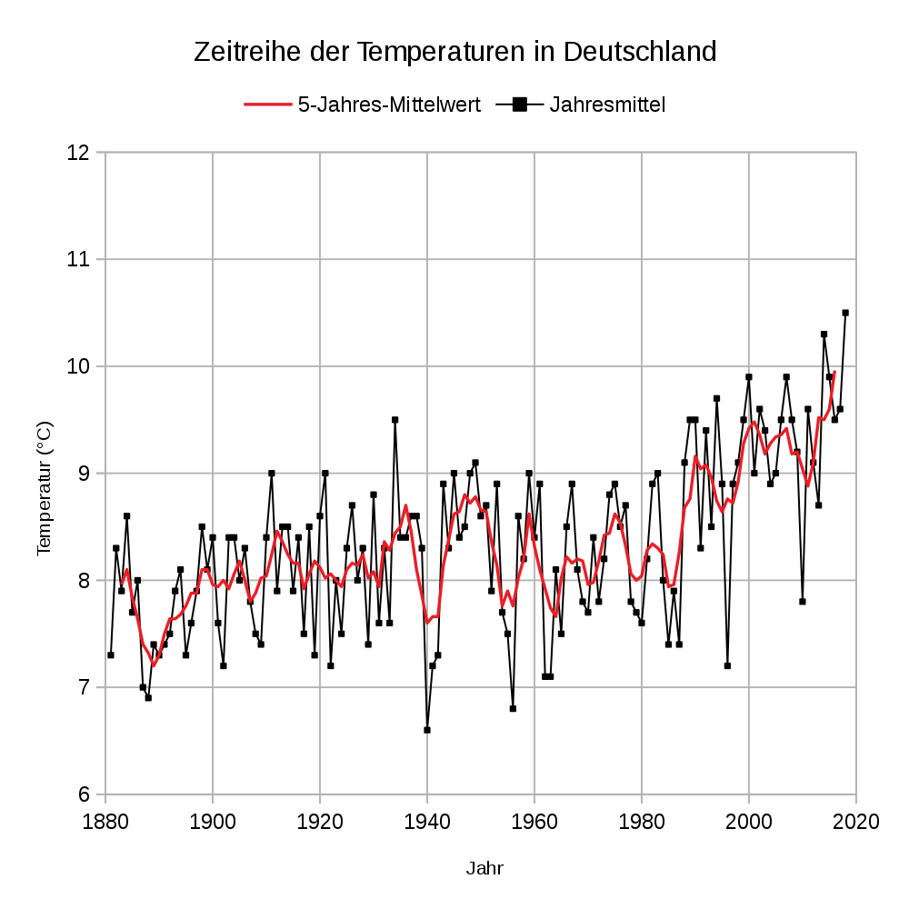

```{r setup, include=FALSE}
knitr::opts_chunk$set(echo = FALSE,message=FALSE,warning=FALSE)
#options(encoding="utf-8")
```

# Purpose

* Analyze heating energy consumption by residential buildings in Germany from 2002 - 2018.
* Understand the impact of government measures in reducing energy consumption.

The topic is of high political significance in the context of international measures to reduce global warming.

# The data

* The data come from the online portal of [co2online gGmbh](www.co2online.de), where private individuals give information relating to the building's energy consumption for a year and features relating to the building (age, area, fuel type, refurbishment measures already carried out, etc.) in return for an evaluation of the building's energy efficiency and suggested refurbishment measures.

* Data from more than 2 million buildings from 2002 - 2018.


```{r}
path_to_file <- "D:/GITHUB_REPOS/visualization-project2-smurfs"
source(paste0(path_to_file , "/" , "getGermanyData.R"))
source(paste0(path_to_file , "/" , "cleanData.R"))
source(paste0(path_to_file , "/" , "getBundeslandfromCode.R"))
source(paste0(path_to_file , "/" , "getBundeslandfromLK.R"))
source(paste0(path_to_file , "/", "getSpecificConsumptionByYear.R"))
source(paste0(path_to_file , "/", "getConsumptionPerEnergieTraeger.R"))

#get data from the Rdata files, impose consistency in data types etc.
DL_MFH <- getGermanyData(gtype = "MFH")
DL_SFH <- getGermanyData(gtype = "SFH")

#remove outliers:
DL_MFH <- cleanData(DL_MFH , "MFH")
DL_SFH <- cleanData(DL_SFH , "SFH")

#find bundesland
DL_MFH <- getBundeslandfromCode(DL_MFH)
DL_SFH <- getBundeslandfromCode(DL_SFH)
DL_SFH <- DL_SFH[!is.na(DL_SFH$bundesland) , ]
DL_SFH <- getBundeslandfromLK(DL_SFH)
#unique(DL_MFH$bundesland)
```


# The data: Multifamily buildings

```{r, size="tiny"}
str(DL_MFH)
```


# The data: One- to two-family buildings

```{r}
str(DL_SFH)
```


```{r}
#library(mosaic)
#detach("package:mosaic", unload=TRUE)
MFH_spez_verbrauch <- getSpecificConsumptionByYear( DL_MFH , DL_SFH , gtype = "MFH")
SFH_spez_verbrauch <- getSpecificConsumptionByYear( DL_MFH , DL_SFH , gtype = "SFH")
ALL_spez_verbrauch <- getSpecificConsumptionByYear( DL_MFH , DL_SFH , gtype = "ALL")
```


```{r}
require(ggplot2)
#g_mfh <- ggplot() + geom_point(data=MFH_spez_verbrauch , aes(x=abrechnungsjahr,y=spz_verbrauch)
#)+scale_y_continuous(limits=c(0,150))

#g_sfh <- ggplot() + geom_point(data=SFH_spez_verbrauch , aes(x=abrechnungsjahr,y=spz_verbrauch)
#)+scale_y_continuous(limits=c(0,150))

#g_all <- ggplot() + geom_point(data=ALL_spez_verbrauch , aes(x=abrechnungsjahr,y=spz_verbrauch)
#)+scale_y_continuous(limits=c(0,150))
```

```{r}
#g_mfh+labs(title="MFH")+scale_x_continuous(name="Year")+scale_y_continuous(name="Specific energy consumption (kWh/m2)",limits=c(0,150))
```

```{r}
#g_sfh+labs(title="1-2FH")+scale_x_continuous(name="Year")+scale_y_continuous(name="Specific energy consumption (kWh/m2)",limits=c(0,150))
```

```{r}
#g_all+labs(title="MFH+SFH")+scale_x_continuous(name="Year")+scale_y_continuous(name="Specific energy consumption (kWh/m2)",limits=c(0,150))
```


```{r}
#ggplot() + geom_point(data=MFH_spez_verbrauch , aes(x=abrechnungsjahr,y=spz_verbrauch,color="MFH")
#)+geom_point(data=SFH_spez_verbrauch , aes(x=abrechnungsjahr,y=spz_verbrauch,color="SFH")
#)+geom_point(data=ALL_spez_verbrauch , aes(x=abrechnungsjahr,y=spz_verbrauch,color="ALL")
#)+scale_y_continuous(limits=c(0,150))+theme_bw()+scale_x_continuous(breaks=seq(2002,2018,2))+labs(x="Year",y=bquote("Specific Consumption" ~ (kWh/m^2)) )
```


# Specific energy consumption in Germany (2002 - 2018)

```{r}
ggplot() + geom_point(data=MFH_spez_verbrauch , aes(x=abrechnungsjahr,y=spz_verbrauch,color="MFH")
)+geom_point(data=SFH_spez_verbrauch , aes(x=abrechnungsjahr,y=spz_verbrauch,color="SFH")
)+geom_point(data=ALL_spez_verbrauch , aes(x=abrechnungsjahr,y=spz_verbrauch,color="ALL")
)+scale_color_discrete(name=" ",labels=c("ALL","MFH","SFH"))+scale_y_continuous(limits=c(0,150))+theme_bw()+scale_x_continuous(breaks=seq(2002,2018,2))+labs(x="Year",y=bquote("Specific Consumption" ~ (kWh/m^2)) )
```


# The cold winter of 2010




# The cold winter of 2010

\


```{r}
#now subset bundesland and do the calculations for specific consumption
# (1) MFH case #calculate the specific consumption and the slope

states <- sort(unique(DL_MFH$bundesland))
bundlands_SV_mfh <- list()
bundlands_SV_sfh <- list()
bundlands_SV_all <- list()
for (s in states) {
  #For MFH:
  #print(s)
  bund_data_mfh <- DL_MFH[DL_MFH$bundesland == s  ,  ]
  specific_con <- getSpecificConsumptionByYear(mfh=bund_data_mfh , sfh=NULL , gtype="MFH")
  #above is a dataframe with columns "abrechnungsjahr","Area","Consumption","spz_verbrauch"
  bundlands_SV_mfh[[s]] <- specific_con
  #For SFH:
  bund_data_sfh <- DL_SFH[DL_SFH$bundesland == s  ,  ]
  specific_con <- getSpecificConsumptionByYear(mfh=NULL , sfh=bund_data_sfh , gtype="SFH")
  bundlands_SV_sfh[[s]] <- specific_con
  #For both:
  specific_con <- getSpecificConsumptionByYear(mfh=bund_data_mfh , sfh=bund_data_sfh , gtype="ALL")
  bundlands_SV_all[[s]] <- specific_con
}

#collect into single data frame - these will be used for plotting in plotly
bundSV_mfh_df <- data.frame(abrechnungsjahr=2002:2018)
bundSV_sfh_df <- data.frame(abrechnungsjahr=2002:2018)
bundSV_all_df <- data.frame(abrechnungsjahr=2002:2018)
for (s in names(bundlands_SV_mfh)) {
  bundSV_mfh_df[[s]] <- bundlands_SV_mfh[[s]]$spz_verbrauch
  bundSV_sfh_df[[s]] <- bundlands_SV_sfh[[s]]$spz_verbrauch
  bundSV_all_df[[s]] <- bundlands_SV_all[[s]]$spz_verbrauch
}
```


# Heat map of states and year


```{r}
library(plotly)
p <- plot_ly(bundSV_mfh_df , x = ~abrechnungsjahr) %>%
  add_markers(y = ~get(states[1]), name = " ",marker=list(color="black")) %>%
  add_markers(y = ~get(states[2]), name = " " , marker=list(color="black"), visible = F) %>%
  add_markers(y = ~get(states[3]), name = " " , marker=list(color="black"), visible = F) %>%
  add_markers(y = ~get(states[4]), name = " " , marker=list(color="black"), visible = F) %>%
  add_markers(y = ~get(states[5]), name = " " , marker=list(color="black"), visible = F) %>%
  add_markers(y = ~get(states[6]), name = " " , marker=list(color="black"), visible = F) %>%
  add_markers(y = ~get(states[7]), name = " " , marker=list(color="black"), visible = F) %>%
  add_markers(y = ~get(states[8]), name = " " , marker=list(color="black"), visible = F) %>%
  add_markers(y = ~get(states[9]), name = " " , marker=list(color="black"), visible = F) %>%
  add_markers(y = ~get(states[10]), name = " " , marker=list(color="black"), visible = F) %>%
  add_markers(y = ~get(states[11]), name = " " , marker=list(color="black"), visible = F) %>%
  add_markers(y = ~get(states[12]), name = " " , marker=list(color="black"), visible = F) %>%
  add_markers(y = ~get(states[13]), name = " " , marker=list(color="black"), visible = F) %>%
  add_markers(y = ~get(states[14]), name = " " , marker=list(color="black"), visible = F) %>%
  add_markers(y = ~get(states[15]), name = " " , marker=list(color="black"), visible = F) %>%
  add_markers(y = ~get(states[16]), name = " " , marker=list(color="black"), visible = F)

p <- p %>% layout(showlegend=FALSE,
  title = "Multifamily Houses",
  xaxis = list(title = "Year",tickvals=list(2002,2004,2006,2008,2010,2012,2014,2016,2018)),
  yaxis = list(title = "kWh/m2",range=c(0,150),tickvals=list(0,20,40,60,80,100,120,140)),
  updatemenus = list(
    list(
      buttons = list(
        list(method = "restyle",
             args = list("visible",list(T,F,F,F,F,F,F,F,F,F,F,F,F,F,F,F)),
             label = states[1]),
        list(method = "restyle",
             args = list("visible",list(F,T,F,F,F,F,F,F,F,F,F,F,F,F,F,F)),
             label = states[2]),
        list(method = "restyle",
             args = list("visible",list(F,F,T,F,F,F,F,F,F,F,F,F,F,F,F,F)),
             label = states[3]),
        list(method = "restyle",
             args = list("visible",list(F,F,F,T,F,F,F,F,F,F,F,F,F,F,F,F)),
             label = states[4]),
        list(method = "restyle",
             args = list("visible",list(F,F,F,F,T,F,F,F,F,F,F,F,F,F,F,F)),
             label = states[5]),
        list(method = "restyle",
             args = list("visible",list(F,F,F,F,F,T,F,F,F,F,F,F,F,F,F,F)),
             label = states[6]),
        list(method = "restyle",
             args = list("visible",list(F,F,F,F,F,F,T,F,F,F,F,F,F,F,F,F)),
             label = states[7]),
        list(method = "restyle",
             args = list("visible",list(F,F,F,F,F,F,F,T,F,F,F,F,F,F,F,F)),
             label = states[8]),
        list(method = "restyle",
             args = list("visible",list(F,F,F,F,F,F,F,F,T,F,F,F,F,F,F,F)),
             label = states[9]),
        list(method = "restyle",
             args = list("visible",list(F,F,F,F,F,F,F,F,F,T,F,F,F,F,F,F)),
             label = states[10]),
        list(method = "restyle",
             args = list("visible",list(F,F,F,F,F,F,F,F,F,F,T,F,F,F,F,F)),
             label = states[11]),
        list(method = "restyle",
             args = list("visible",list(F,F,F,F,F,F,F,F,F,F,F,T,F,F,F,F)),
             label = states[12]),
        list(method = "restyle",
             args = list("visible",list(F,F,F,F,F,F,F,F,F,F,F,F,T,F,F,F)),
             label = states[13]),
        list(method = "restyle",
             args = list("visible",list(F,F,F,F,F,F,F,F,F,F,F,F,F,T,F,F)),
             label = states[14]),
        list(method = "restyle",
             args = list("visible",list(F,F,F,F,F,F,F,F,F,F,F,F,F,F,T,F)),
             label = states[15]),
        list(method = "restyle",
             args = list("visible",list(F,F,F,F,F,F,F,F,F,F,F,F,F,F,F,T)),
             label = states[16])
      )
    )
  )
)

p
```


# Next

```{r}
p <- plot_ly(bundSV_sfh_df , x = ~abrechnungsjahr) %>%
  add_markers(y = ~get(states[1]), name = " ",marker=list(color="black")) %>%
  add_markers(y = ~get(states[2]), name = " " , marker=list(color="black"), visible = F) %>%
  add_markers(y = ~get(states[3]), name = " " , marker=list(color="black"), visible = F) %>%
  add_markers(y = ~get(states[4]), name = " " , marker=list(color="black"), visible = F) %>%
  add_markers(y = ~get(states[5]), name = " " , marker=list(color="black"), visible = F) %>%
  add_markers(y = ~get(states[6]), name = " " , marker=list(color="black"), visible = F) %>%
  add_markers(y = ~get(states[7]), name = " " , marker=list(color="black"), visible = F) %>%
  add_markers(y = ~get(states[8]), name = " " , marker=list(color="black"), visible = F) %>%
  add_markers(y = ~get(states[9]), name = " " , marker=list(color="black"), visible = F) %>%
  add_markers(y = ~get(states[10]), name = " " , marker=list(color="black"), visible = F) %>%
  add_markers(y = ~get(states[11]), name = " " , marker=list(color="black"), visible = F) %>%
  add_markers(y = ~get(states[12]), name = " " , marker=list(color="black"), visible = F) %>%
  add_markers(y = ~get(states[13]), name = " " , marker=list(color="black"), visible = F) %>%
  add_markers(y = ~get(states[14]), name = " " , marker=list(color="black"), visible = F) %>%
  add_markers(y = ~get(states[15]), name = " " , marker=list(color="black"), visible = F) %>%
  add_markers(y = ~get(states[16]), name = " " , marker=list(color="black"), visible = F)

p <- p %>% layout(showlegend=FALSE,
  title = "1-2 Family Houses",
  xaxis = list(title = "Year",tickvals=list(2002,2004,2006,2008,2010,2012,2014,2016,2018)),
  yaxis = list(title = "kWh/m2",range=c(0,180),tickvals=list(0,20,40,60,80,100,120,140,160,180)),
  updatemenus = list(
    list(
      buttons = list(
        list(method = "restyle",
             args = list("visible",list(T,F,F,F,F,F,F,F,F,F,F,F,F,F,F,F)),
             label = states[1]),
        list(method = "restyle",
             args = list("visible",list(F,T,F,F,F,F,F,F,F,F,F,F,F,F,F,F)),
             label = states[2]),
        list(method = "restyle",
             args = list("visible",list(F,F,T,F,F,F,F,F,F,F,F,F,F,F,F,F)),
             label = states[3]),
        list(method = "restyle",
             args = list("visible",list(F,F,F,T,F,F,F,F,F,F,F,F,F,F,F,F)),
             label = states[4]),
        list(method = "restyle",
             args = list("visible",list(F,F,F,F,T,F,F,F,F,F,F,F,F,F,F,F)),
             label = states[5]),
        list(method = "restyle",
             args = list("visible",list(F,F,F,F,F,T,F,F,F,F,F,F,F,F,F,F)),
             label = states[6]),
        list(method = "restyle",
             args = list("visible",list(F,F,F,F,F,F,T,F,F,F,F,F,F,F,F,F)),
             label = states[7]),
        list(method = "restyle",
             args = list("visible",list(F,F,F,F,F,F,F,T,F,F,F,F,F,F,F,F)),
             label = states[8]),
        list(method = "restyle",
             args = list("visible",list(F,F,F,F,F,F,F,F,T,F,F,F,F,F,F,F)),
             label = states[9]),
        list(method = "restyle",
             args = list("visible",list(F,F,F,F,F,F,F,F,F,T,F,F,F,F,F,F)),
             label = states[10]),
        list(method = "restyle",
             args = list("visible",list(F,F,F,F,F,F,F,F,F,F,T,F,F,F,F,F)),
             label = states[11]),
        list(method = "restyle",
             args = list("visible",list(F,F,F,F,F,F,F,F,F,F,F,T,F,F,F,F)),
             label = states[12]),
        list(method = "restyle",
             args = list("visible",list(F,F,F,F,F,F,F,F,F,F,F,F,T,F,F,F)),
             label = states[13]),
        list(method = "restyle",
             args = list("visible",list(F,F,F,F,F,F,F,F,F,F,F,F,F,T,F,F)),
             label = states[14]),
        list(method = "restyle",
             args = list("visible",list(F,F,F,F,F,F,F,F,F,F,F,F,F,F,T,F)),
             label = states[15]),
        list(method = "restyle",
             args = list("visible",list(F,F,F,F,F,F,F,F,F,F,F,F,F,F,F,T)),
             label = states[16])
      )
    )
  )
)

p
```


```{r}
p <- plot_ly(bundSV_all_df , x = ~abrechnungsjahr) %>%
  add_markers(y = ~get(states[1]), name = " ",marker=list(color="black")) %>%
  add_markers(y = ~get(states[2]), name = " " , marker=list(color="black"), visible = F) %>%
  add_markers(y = ~get(states[3]), name = " " , marker=list(color="black"), visible = F) %>%
  add_markers(y = ~get(states[4]), name = " " , marker=list(color="black"), visible = F) %>%
  add_markers(y = ~get(states[5]), name = " " , marker=list(color="black"), visible = F) %>%
  add_markers(y = ~get(states[6]), name = " " , marker=list(color="black"), visible = F) %>%
  add_markers(y = ~get(states[7]), name = " " , marker=list(color="black"), visible = F) %>%
  add_markers(y = ~get(states[8]), name = " " , marker=list(color="black"), visible = F) %>%
  add_markers(y = ~get(states[9]), name = " " , marker=list(color="black"), visible = F) %>%
  add_markers(y = ~get(states[10]), name = " " , marker=list(color="black"), visible = F) %>%
  add_markers(y = ~get(states[11]), name = " " , marker=list(color="black"), visible = F) %>%
  add_markers(y = ~get(states[12]), name = " " , marker=list(color="black"), visible = F) %>%
  add_markers(y = ~get(states[13]), name = " " , marker=list(color="black"), visible = F) %>%
  add_markers(y = ~get(states[14]), name = " " , marker=list(color="black"), visible = F) %>%
  add_markers(y = ~get(states[15]), name = " " , marker=list(color="black"), visible = F) %>%
  add_markers(y = ~get(states[16]), name = " " , marker=list(color="black"), visible = F)
#https://stackoverflow.com/questions/34093169/horizontal-vertical-line-in-plotly
p <- p %>% layout(showlegend=FALSE,
  title = "Multi and 1-2 Family Houses",
  xaxis = list(title = "Year",tickvals=list(2002,2004,2006,2008,2010,2012,2014,2016,2018)),
  yaxis = list(title = "kWh/m2",range=c(0,160),tickvals=list(0,20,40,60,80,100,120,140,160)),
  shapes=list(type='line', x0= 2001, x1= 2001, y0=0, y1=160, line=list(width=1)),
  updatemenus = list(
    list(
      buttons = list(
        list(method = "restyle",
             args = list("visible",list(T,F,F,F,F,F,F,F,F,F,F,F,F,F,F,F)),
             label = states[1]),
        list(method = "restyle",
             args = list("visible",list(F,T,F,F,F,F,F,F,F,F,F,F,F,F,F,F)),
             label = states[2]),
        list(method = "restyle",
             args = list("visible",list(F,F,T,F,F,F,F,F,F,F,F,F,F,F,F,F)),
             label = states[3]),
        list(method = "restyle",
             args = list("visible",list(F,F,F,T,F,F,F,F,F,F,F,F,F,F,F,F)),
             label = states[4]),
        list(method = "restyle",
             args = list("visible",list(F,F,F,F,T,F,F,F,F,F,F,F,F,F,F,F)),
             label = states[5]),
        list(method = "restyle",
             args = list("visible",list(F,F,F,F,F,T,F,F,F,F,F,F,F,F,F,F)),
             label = states[6]),
        list(method = "restyle",
             args = list("visible",list(F,F,F,F,F,F,T,F,F,F,F,F,F,F,F,F)),
             label = states[7]),
        list(method = "restyle",
             args = list("visible",list(F,F,F,F,F,F,F,T,F,F,F,F,F,F,F,F)),
             label = states[8]),
        list(method = "restyle",
             args = list("visible",list(F,F,F,F,F,F,F,F,T,F,F,F,F,F,F,F)),
             label = states[9]),
        list(method = "restyle",
             args = list("visible",list(F,F,F,F,F,F,F,F,F,T,F,F,F,F,F,F)),
             label = states[10]),
        list(method = "restyle",
             args = list("visible",list(F,F,F,F,F,F,F,F,F,F,T,F,F,F,F,F)),
             label = states[11]),
        list(method = "restyle",
             args = list("visible",list(F,F,F,F,F,F,F,F,F,F,F,T,F,F,F,F)),
             label = states[12]),
        list(method = "restyle",
             args = list("visible",list(F,F,F,F,F,F,F,F,F,F,F,F,T,F,F,F)),
             label = states[13]),
        list(method = "restyle",
             args = list("visible",list(F,F,F,F,F,F,F,F,F,F,F,F,F,T,F,F)),
             label = states[14]),
        list(method = "restyle",
             args = list("visible",list(F,F,F,F,F,F,F,F,F,F,F,F,F,F,T,F)),
             label = states[15]),
        list(method = "restyle",
             args = list("visible",list(F,F,F,F,F,F,F,F,F,F,F,F,F,F,F,T)),
             label = states[16])
      )
    )
  )
)

p
```


```
slopes_data <- data.frame(bundesland=states)
slope_values_mfh <- NULL
slope_values_sfh <- NULL
slope_values_all <- NULL
for (s in states) {
  lm_sv_bund_mfh <- lm(spz_verbrauch ~ abrechnungsjahr , data = bundlands_SV_mfh[[s]])
  lm_sv_bund_sfh <- lm(spz_verbrauch ~ abrechnungsjahr , data = bundlands_SV_sfh[[s]])
  lm_sv_bund_all <- lm(spz_verbrauch ~ abrechnungsjahr , data = bundlands_SV_all[[s]])
  
  slope_values_mfh <- c(slope_values_mfh , lm_sv_bund_mfh$coefficients[2])
  slope_values_sfh <- c(slope_values_sfh , lm_sv_bund_sfh$coefficients[2])
  slope_values_all <- c(slope_values_all , lm_sv_bund_all$coefficients[2])
}
slopes_data$MFH <- slope_values_mfh 
slopes_data$SFH <- slope_values_sfh
slopes_data$ALL <- slope_values_all

library(sf)
library(dplyr)
library(ggplot2)
DL_map <- st_read("D:/GITHUB_REPOS/visualization-project2-smurfs/shapefiles/gadm36_DEU_shp/gadm36_DEU_1.shp",stringsAsFactors = FALSE)
#DL_map <- st_read("~/Desktop/visualization-project2-smurfs/shapefiles/gadm36_DEU_shp/gadm36_DEU_1.shp",
#                 stringsAsFactors = FALSE)
```


```
library(tmap)
library(tmaptools)
DL_map$MFH <- slopes_data$MFH #merge or inner_join gives error
tmap_mode("view")
tm_shape(DL_map) + tm_polygons("MFH",
                               id="NAME_1",
                               popup.vars=c("MFH"),
                               style="cont",
                               midpoint=NA,
                               palette="seq"
                               #legend.reverse=TRUE - Gives WRONG info!
)+tm_layout(aes.palette=list(seq="-RdYlGn"))
```


```
DL_map$SFH <- slopes_data$SFH #merge or inner_join gives error
tmap_mode("view")
tm_shape(DL_map) + tm_polygons("SFH",
                               id="NAME_1",
                               popup.vars=c("SFH"),
                               style="cont",
                               midpoint=NA,
                               palette="seq"
                               #legend.reverse=TRUE - Gives WRONG info!
)+tm_layout(aes.palette=list(seq="-RdYlGn"))
```


```
DL_map$ALL <- slopes_data$ALL #merge or inner_join gives error
tmap_mode("view")
tm_shape(DL_map) + tm_polygons("ALL",
                               id="NAME_1",
                               popup.vars=c("ALL"),
                               style="cont",
                               midpoint=NA,
                               palette="seq"
                               #legend.reverse=TRUE - Gives WRONG info!
)+tm_layout(aes.palette=list(seq="-RdYlGn"))
```


```{r}
i1 <- ggplot(data=absolute_freq(DL_MFH), aes(x=abrechnungsjahr , y=value, fill=energietraeger)) +
  geom_bar(stat="identity") + scale_fill_brewer(palette="Dark2") + ggtitle('MFH - absolute freq') +  theme_bw() +
  theme(plot.title = element_text(hjust = 0.5),legend.position="none")

i2 <-  ggplot(data=relative_freq(DL_MFH), aes(x=abrechnungsjahr , y=value, fill=energietraeger)) +
  geom_bar(stat="identity") + scale_fill_brewer(palette="Dark2") + ggtitle('MFH - rel freq') +  theme_bw() +
  theme(plot.title = element_text(hjust = 0.5),legend.position=c(1.5,0.5),legend.direction="vertical")

require(grid)
require(gridExtra)

grid.arrange(i1,i2,ncol=2)

absolute_freq(DL_MFH)
```


```{r}
i1 <- ggplot(data = absolute_freq(DL_SFH), aes(x=abrechnungsjahr , y=value, fill=energietraeger)) +
  geom_bar(stat="identity") + scale_fill_brewer(palette="Dark2") + ggtitle('SFH - absolute freq') +
  theme(plot.title = element_text(hjust = 0.5),legend.position="none")

i2 <-  ggplot(data=relative_freq(DL_SFH), aes(x=abrechnungsjahr , y=value, fill=energietraeger)) +
  geom_bar(stat="identity")  + scale_fill_brewer(palette="Dark2") + ggtitle('SFH - relative freq') + 
  theme(plot.title = element_text(hjust = 0.5),legend.position=c(1.5,0.5),legend.direction="vertical") 

grid.arrange(i1,i2,ncol=2)

#absolute_freq(DL_SFH)
```

```{r}

i1 <- ggplot(data = absolute_freq(rbind(DL_SFH, DL_MFH)), aes(x=abrechnungsjahr , y=value, fill=energietraeger)) +
  geom_bar(stat="identity") + scale_fill_brewer(palette="Dark2") + ggtitle('MFH and SFH - absolute freq') +
  theme(plot.title = element_text(hjust = 0.5),legend.position="none")

i2 <-  ggplot(data=relative_freq(rbind(DL_SFH, DL_MFH)), aes(x=abrechnungsjahr , y=value, fill=energietraeger)) +
  geom_bar(stat="identity")  + scale_fill_brewer(palette="Dark2") + ggtitle('MFH and SFH - relative freq') + 
  theme(plot.title = element_text(hjust = 0.5),legend.position=c(1.5,0.5),legend.direction="vertical") 

grid.arrange(i1,i2,ncol=2)
#absolute_freq(rbind(DL_SFH, DL_MFH))
```

```{r}

get_absolute_frequencies_interactive <- function(data, title) {
  bundlands_energietraeger <- absolute_freq_interactive(data)
  
  p <- plot_ly(type = 'bar', colors = "Blues") 
  
  v = TRUE
  for (i in 1:length(states)) {
    p <- p %>% add_trace(y = bundlands_energietraeger[bundlands_energietraeger$bundesland == states[[i]],]$erdgas, name = 'Erdgas',  
                         x = 2002:2018, visible = v, colors = "Blues") 
    p <- p %>% add_trace(y = bundlands_energietraeger[bundlands_energietraeger$bundesland == states[[i]],]$fluessiggas, name = 'Fluessiggas',  
                         x = 2002:2018, visible = v, colors = "Blues") 
    p <- p %>% add_trace(y = bundlands_energietraeger[bundlands_energietraeger$bundesland == states[[i]],]$heizoel, name = 'Heizoel',  
                         x = 2002:2018, visible = v, colors = "Blues") 
    p <- p %>% add_trace(y = bundlands_energietraeger[bundlands_energietraeger$bundesland == states[[i]],]$holzpellets, name = 'Holzpellets',  
                         x = 2002:2018, visible = v, colors = "Blues") 
    p <- p %>% add_trace(y = bundlands_energietraeger[bundlands_energietraeger$bundesland == states[[i]],]$strom, name = 'Strom',  
                         x = 2002:2018, visible = v, colors = "Blues") 
    p <- p %>% add_trace(y = bundlands_energietraeger[bundlands_energietraeger$bundesland == states[[i]],]$waerme, name = 'Waerme',  
                         x = 2002:2018, visible = v, colors = "Blues") 
  
    v = FALSE
  }
  
  p <- p %>% layout(
      xaxis = list(range = c(2002, 2018)),
      barmode='stack',
      colorway = c('#e8288a','#1f9d75', '#e2ab07', '#756eb2', '#d95e00', '#68a61e'))

  p <- p %>% layout(
    title = title,
    xaxis = list(title = "Year", range = c(2002, 2018)),
    yaxis = list(title = "Value"),
    updatemenus = list(
      list(
        buttons = get_visibility_combinations()
      )
    )
  )
return(p)
}
```
```{r}
library(plotly)
library(tidyr)
get_relative_frequencies_interactive <- function(data, title) {
  bundlands_energietraeger <- relative_freq_interactive(data)
  
  p <- plot_ly(type = 'bar')
  v = TRUE
  for (i in 1:length(states)) {
    p <- p %>% add_trace(y = bundlands_energietraeger[bundlands_energietraeger$bundesland == states[[i]],]$erdgas, name = 'Erdgas',  
                         x = 2002:2018, visible = v)
    p <- p %>% add_trace(y = bundlands_energietraeger[bundlands_energietraeger$bundesland == states[[i]],]$fluessiggas, name = 'Fluessiggas',  
                         x = 2002:2018, visible = v)
    p <- p %>% add_trace(y = bundlands_energietraeger[bundlands_energietraeger$bundesland == states[[i]],]$heizoel, name = 'Heizoel',  
                         x = 2002:2018, visible = v)
    p <- p %>% add_trace(y = bundlands_energietraeger[bundlands_energietraeger$bundesland == states[[i]],]$holzpellets, name = 'Holzpellets',  
                         x = 2002:2018, visible = v)
    p <- p %>% add_trace(y = bundlands_energietraeger[bundlands_energietraeger$bundesland == states[[i]],]$strom, name = 'Strom',  
                         x = 2002:2018, visible = v)
    p <- p %>% add_trace(y = bundlands_energietraeger[bundlands_energietraeger$bundesland == states[[i]],]$waerme, name = 'Waerme',  
                         x = 2002:2018, visible = v)
  
    v = FALSE
  }
  
  
  p <- p %>% layout(
      xaxis = list(range = c(2002, 2018)),
      barmode='stack',
      colorway = c('#e8288a','#1f9d75', '#e2ab07', '#756eb2', '#d95e00', '#68a61e'))
  
  p <- p %>% layout(
    title = title,
    xaxis = list(title = "Year", range = c(2002, 2018)),
    yaxis = list(title = "Value"),
    barmode ='stack',
    updatemenus = list(
      list(
        buttons = get_visibility_combinations()
      )
    )
  )
  return(p)
}
```
```{r}
library(plotly)
library(tidyr)

get_absolute_frequencies_interactive(DL_MFH, 'Energie Traeger MFH - absolute freq')
```
```{r}
get_relative_frequencies_interactive(DL_MFH, 'Energie Traeger MFH -  relative freq')
```
```{r}
library(plotly)
library(tidyr)

get_absolute_frequencies_interactive(DL_SFH, 'Energie Traeger SFH - absolute freq')
```
```{r}
library(plotly)
library(tidyr)

get_relative_frequencies_interactive(DL_SFH, 'Energie Traeger SFH - relative freq')
```

```{r}
library(plotly)
library(tidyr)

get_absolute_frequencies_interactive(rbind(DL_SFH, DL_MFH), 'Energie Traeger SFH and MFH - absolute freq')
```

```{r}
library(plotly)
library(tidyr)

get_relative_frequencies_interactive(rbind(DL_SFH, DL_MFH), 'Energie Traeger SFH and MFH - relative freq')
```
