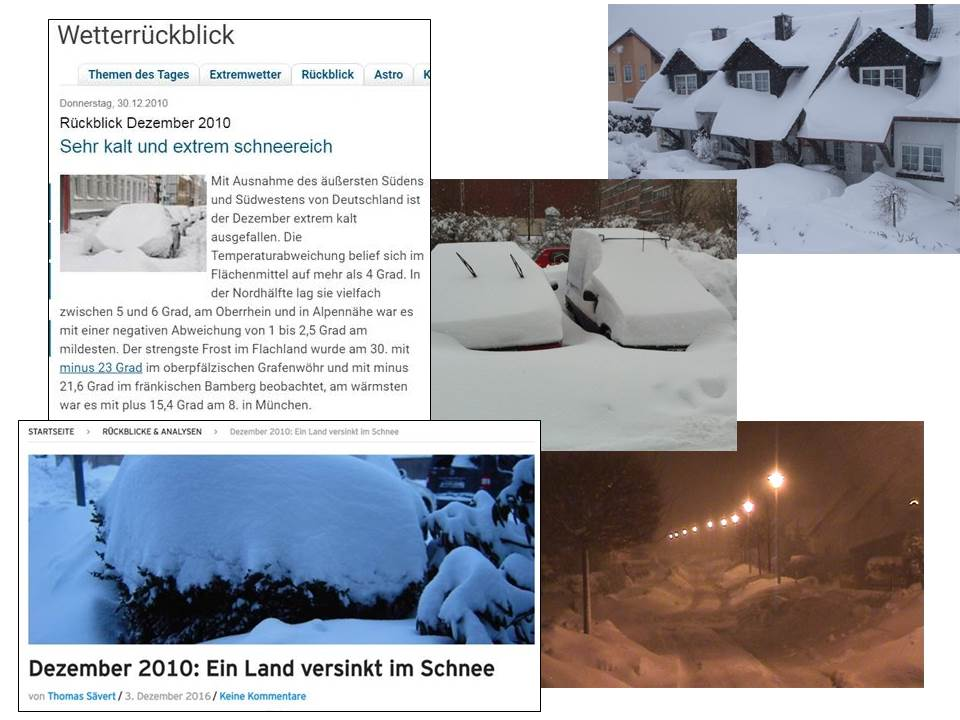

```{r setup, include=FALSE}
knitr::opts_chunk$set(echo = FALSE,message=FALSE,warning=FALSE)
#options(encoding="utf-8")
```

# Purpose

* Analyze heating energy consumption by residential buildings in Germany from 2002 - 2018.
* Understand the impact of government measures in reducing energy consumption.

The topic is of high political significance in the context of international measures to reduce global warming.

# The data

* The data come from the online portal of [co2online gGmbh](www.co2online.de), where private individuals give information relating to the building's energy consumption for a year and features relating to the building (age, area, fuel type, refurbishment measures already carried out, etc.) in return for an evaluation of the building's energy efficiency and suggested refurbishment measures.

* Data from more than 2 million buildings from 2002 - 2018.


```{r}
path_to_file <- "D:/GITHUB_REPOS/visualization-project2-smurfs/" # do not delete; comment out if not required
```

```{r}
source(paste0(path_to_file, "getGermanyData.R"))
source(paste0(path_to_file, "cleanData.R"))
source(paste0(path_to_file, "getBundeslandfromCode.R"))
source(paste0(path_to_file, "getBundeslandfromLK.R"))
source(paste0(path_to_file, "getSpecificConsumptionByYear.R"))
source(paste0(path_to_file, "getConsumptionPerEnergieTraeger.R"))

#get data from the Rdata files, impose consistency in data types etc.
DL_MFH <- getGermanyData(gtype = "MFH")
DL_SFH <- getGermanyData(gtype = "SFH")

#remove outliers:
DL_MFH <- cleanData(DL_MFH , "MFH")
DL_SFH <- cleanData(DL_SFH , "SFH")

#find bundesland
DL_MFH <- getBundeslandfromCode(DL_MFH)
DL_SFH <- getBundeslandfromCode(DL_SFH)
DL_SFH <- DL_SFH[!is.na(DL_SFH$bundesland) , ]
DL_SFH <- getBundeslandfromLK(DL_SFH)
#unique(DL_MFH$bundesland)
```


# The data: Multifamily buildings

```{r, size="tiny"}
str(DL_MFH)
```


# The data: One- to two-family buildings

```{r}
str(DL_SFH)
```


```{r}
#library(mosaic)
#detach("package:mosaic", unload=TRUE)
MFH_spez_verbrauch <- getSpecificConsumptionByYear( DL_MFH , DL_SFH , gtype = "MFH")
SFH_spez_verbrauch <- getSpecificConsumptionByYear( DL_MFH , DL_SFH , gtype = "SFH")
ALL_spez_verbrauch <- getSpecificConsumptionByYear( DL_MFH , DL_SFH , gtype = "ALL")
```


```{r}
require(ggplot2)
#g_mfh <- ggplot() + geom_point(data=MFH_spez_verbrauch , aes(x=abrechnungsjahr,y=spz_verbrauch)
#)+scale_y_continuous(limits=c(0,150))

#g_sfh <- ggplot() + geom_point(data=SFH_spez_verbrauch , aes(x=abrechnungsjahr,y=spz_verbrauch)
#)+scale_y_continuous(limits=c(0,150))

#g_all <- ggplot() + geom_point(data=ALL_spez_verbrauch , aes(x=abrechnungsjahr,y=spz_verbrauch)
#)+scale_y_continuous(limits=c(0,150))
```

```{r}
#g_mfh+labs(title="MFH")+scale_x_continuous(name="Year")+scale_y_continuous(name="Specific energy consumption (kWh/m2)",limits=c(0,150))
```

```{r}
#g_sfh+labs(title="1-2FH")+scale_x_continuous(name="Year")+scale_y_continuous(name="Specific energy consumption (kWh/m2)",limits=c(0,150))
```

```{r}
#g_all+labs(title="MFH+SFH")+scale_x_continuous(name="Year")+scale_y_continuous(name="Specific energy consumption (kWh/m2)",limits=c(0,150))
```


```{r}
#ggplot() + geom_point(data=MFH_spez_verbrauch , aes(x=abrechnungsjahr,y=spz_verbrauch),color="red"
#)+geom_point(data=SFH_spez_verbrauch , aes(x=abrechnungsjahr,y=spz_verbrauch),color="green"
#)+geom_point(data=ALL_spez_verbrauch , aes(x=abrechnungsjahr,y=spz_verbrauch),color="yellow"
#)+scale_y_continuous(limits=c(0,150))+theme_bw()+scale_x_continuous(breaks=seq(2002,2018,2))+labs(x="Year",y=bquote("Specific Consumption" ~ #(kWh/m^2)) )
```


# Specific energy consumption in Germany (2002 - 2018)

```{r}
lm_mfh <- lm(spz_verbrauch ~ abrechnungsjahr , data = MFH_spez_verbrauch)
lm_sfh <- lm(spz_verbrauch ~ abrechnungsjahr , data = SFH_spez_verbrauch)
lm_all <- lm(spz_verbrauch ~ abrechnungsjahr , data = ALL_spez_verbrauch)
mfh_pred <- data.frame(abrechnungsjahr=2002:2018)
sfh_pred <- data.frame(abrechnungsjahr=2002:2018)
all_pred <- data.frame(abrechnungsjahr=2002:2018)
mfh_pred$pred <- predict(lm_mfh , newdata = mfh_pred)
sfh_pred$pred <- predict(lm_sfh , newdata = sfh_pred)
all_pred$pred <- predict(lm_all , newdata = all_pred)
bmfh <- c(as.numeric(lm_mfh$coefficients[1]),as.numeric(lm_mfh$coefficients[2]))
bsfh <- c(as.numeric(lm_sfh$coefficients[1]),as.numeric(lm_sfh$coefficients[2]))
ball <- c(as.numeric(lm_all$coefficients[1]),as.numeric(lm_all$coefficients[2]))
gg_color_hue <- function(n) {
  hues = seq(15, 375, length = n + 1)
  hcl(h = hues, l = 65, c = 100)[1:n]
}
```

```{r}
#ggplot() + geom_point(data=MFH_spez_verbrauch , aes(x=abrechnungsjahr,y=spz_verbrauch,color="MFH")
#)+geom_point(data=SFH_spez_verbrauch , aes(x=abrechnungsjahr,y=spz_verbrauch,color="SFH")
#)+geom_point(data=ALL_spez_verbrauch , aes(x=abrechnungsjahr,y=spz_verbrauch,color="ALL")
#)+geom_line(data=mfh_pred,aes(x=abrechnungsjahr,y=pred),color=gg_color_hue(3)[2]
#)+geom_line(data=sfh_pred,aes(x=abrechnungsjahr,y=pred),color=gg_color_hue(3)[3]
#)+geom_line(data=all_pred,aes(x=abrechnungsjahr,y=pred),color=gg_color_hue(3)[1]
#)+scale_color_discrete(name=" ",labels=c("ALL","MFH","SFH"))+scale_y_continuous(limits=c(0,150))+theme_bw(base_size=22)+scale_x_continuous(breaks=seq(2002,2018,2))+labs(x="Year",y=bquote("Specific Consumption" ~ (kWh/m^2)) )
```

```{r}
#confint(lm_mfh,"abrechnungsjahr",level=0.95)
```

```{r}
ggplot() + geom_point(data=MFH_spez_verbrauch , aes(x=abrechnungsjahr,y=spz_verbrauch,color="MFH")
)+geom_point(data=SFH_spez_verbrauch , aes(x=abrechnungsjahr,y=spz_verbrauch,color="SFH")
)+geom_point(data=ALL_spez_verbrauch , aes(x=abrechnungsjahr,y=spz_verbrauch,color="ALL")
)+geom_smooth(method="lm",data=MFH_spez_verbrauch,aes(x=abrechnungsjahr,y=spz_verbrauch),color=gg_color_hue(3)[2],se=FALSE
)+geom_smooth(method="lm",data=SFH_spez_verbrauch,aes(x=abrechnungsjahr,y=spz_verbrauch),color=gg_color_hue(3)[3],se=FALSE
)+geom_smooth(method="lm",data=ALL_spez_verbrauch,aes(x=abrechnungsjahr,y=spz_verbrauch),color=gg_color_hue(3)[1],se=FALSE
)+scale_color_discrete(name=" ",labels=c("ALL","MFH","SFH"))+scale_y_continuous(limits=c(0,150))+theme_bw(base_size=22)+scale_x_continuous(breaks=seq(2002,2018,2))+labs(x="Year",y=bquote("Specific Consumption" ~ (kWh/m^2)) )
```


# The cold winter of 2010


# The cold winter of 2010

\


# Insights

* The spike in 2010 corresponds to the cold winter of that year.
* One- to two-family houses have a larger specific energy consumption compared to multifamily houses.
* But their rate of decrease is faster than multifamily buildings.


```{r}
#now subset bundesland and do the calculations for specific consumption
# (1) MFH case #calculate the specific consumption and the slope

states <- sort(unique(DL_MFH$bundesland))
bundlands_SV_mfh <- list()
bundlands_SV_sfh <- list()
bundlands_SV_all <- list()
for (s in states) {
  #For MFH:
  #print(s)
  bund_data_mfh <- DL_MFH[DL_MFH$bundesland == s  ,  ]
  specific_con <- getSpecificConsumptionByYear(mfh=bund_data_mfh , sfh=NULL , gtype="MFH")
  #above is a dataframe with columns "abrechnungsjahr","Area","Consumption","spz_verbrauch"
  bundlands_SV_mfh[[s]] <- specific_con
  #For SFH:
  bund_data_sfh <- DL_SFH[DL_SFH$bundesland == s  ,  ]
  specific_con <- getSpecificConsumptionByYear(mfh=NULL , sfh=bund_data_sfh , gtype="SFH")
  bundlands_SV_sfh[[s]] <- specific_con
  #For both:
  specific_con <- getSpecificConsumptionByYear(mfh=bund_data_mfh , sfh=bund_data_sfh , gtype="ALL")
  bundlands_SV_all[[s]] <- specific_con
}

#collect into single data frame - these will be used for plotting in plotly
bundSV_mfh_df <- data.frame(abrechnungsjahr=2002:2018)
bundSV_sfh_df <- data.frame(abrechnungsjahr=2002:2018)
bundSV_all_df <- data.frame(abrechnungsjahr=2002:2018)
for (s in names(bundlands_SV_mfh)) {
  bundSV_mfh_df[[s]] <- bundlands_SV_mfh[[s]]$spz_verbrauch
  bundSV_sfh_df[[s]] <- bundlands_SV_sfh[[s]]$spz_verbrauch
  bundSV_all_df[[s]] <- bundlands_SV_all[[s]]$spz_verbrauch
}
```


---


```{r}
slope_low  <- abs(c(confint(lm_mfh,"abrechnungsjahr",level=0.95)[2],confint(lm_sfh,"abrechnungsjahr",level=0.95)[2],confint(lm_all,"abrechnungsjahr",level=0.95)[2]))
slope_high  <- abs(c(confint(lm_mfh,"abrechnungsjahr",level=0.95)[1],confint(lm_sfh,"abrechnungsjahr",level=0.95)[1],confint(lm_all,"abrechnungsjahr",level=0.95)[1]))
slope_high <-
slopedata <- data.frame(gtype=c("MFH","SFH","Both"),slope=abs(c(bmfh[2],bsfh[2],ball[2])),slope_low=slope_low,slope_high=slope_high)
ggplot(data=slopedata,aes(x=gtype,y=slope))+geom_bar(stat="identity",width=0.5) + geom_errorbar(aes(ymin=slope_low,ymax=slope_high),width=0.2) + coord_flip() + labs(title="Rate of change of specific energy consumption in Germany (2002 - 2018)",x="Building type")+theme_bw(base_size = 15)
```


# Heat map of states and years - Multifamily buildings


```{r}
require(reshape2)
bundSV_mfh_long <- melt(bundSV_mfh_df, id.vars="abrechnungsjahr")
bundSV_sfh_long <- melt(bundSV_sfh_df, id.vars="abrechnungsjahr")
bundSV_all_long <- melt(bundSV_all_df, id.vars="abrechnungsjahr")
names(bundSV_mfh_long) <- c("abrechnungsjahr","bundesland","spz_verbrauch")
names(bundSV_sfh_long) <- c("abrechnungsjahr","bundesland","spz_verbrauch")
names(bundSV_all_long) <- c("abrechnungsjahr","bundesland","spz_verbrauch")
g1 <- ggplot(data = bundSV_mfh_long , aes(x=abrechnungsjahr , y=bundesland , fill = spz_verbrauch)) + geom_tile()+scale_fill_gradient(low="green",high="red",name=bquote(kWh/m^2),breaks=c(90,115,140))+labs(x="Year",y="")+theme(legend.position="bottom",legend.direction="horizontal")+scale_x_continuous(breaks=seq(2002,2018,2))
g2 <- ggplot(data = bundSV_sfh_long , aes(x=abrechnungsjahr , y=bundesland , fill = spz_verbrauch)) + geom_tile()+scale_fill_gradient(low="green",high="red",name=bquote(kWh/m^2))+labs(x="Year",y="")+theme(legend.position="bottom",legend.direction="horizontal")+scale_x_continuous(breaks=seq(2002,2018,2))
g3 <- ggplot(data = bundSV_all_long , aes(x=abrechnungsjahr , y=bundesland , fill = spz_verbrauch)) + geom_tile()+scale_fill_gradient(low="green",high="red",name=bquote(kWh/m^2))+labs(x="Year",y="")+theme(legend.position="bottom",legend.direction="horizontal")+scale_x_continuous(breaks=seq(2002,2018,2))
```

```{r}
g1
```


# Heat map of states and years: 1-2 family buildings


```{r}
g2
```

# Heat map of states and years: MFH + SFH combined

```{r}
g3
```


# Slopes for the States - MFH

```{r}
abrechnungsjahr = 2002:2018
lm1 <- lm(as.matrix(bundSV_mfh_df[states[1]]) ~ abrechnungsjahr)
lm2 <- lm(as.matrix(bundSV_mfh_df[states[2]]) ~ abrechnungsjahr)
lm3 <- lm(as.matrix(bundSV_mfh_df[states[3]]) ~ abrechnungsjahr)
lm4 <- lm(as.matrix(bundSV_mfh_df[states[4]]) ~ abrechnungsjahr)
lm5 <- lm(as.matrix(bundSV_mfh_df[states[5]]) ~ abrechnungsjahr)
lm6 <- lm(as.matrix(bundSV_mfh_df[states[6]]) ~ abrechnungsjahr)
lm7 <- lm(as.matrix(bundSV_mfh_df[states[7]]) ~ abrechnungsjahr)
lm8 <- lm(as.matrix(bundSV_mfh_df[states[8]]) ~ abrechnungsjahr)
lm9 <- lm(as.matrix(bundSV_mfh_df[states[9]]) ~ abrechnungsjahr)
lm10 <- lm(as.matrix(bundSV_mfh_df[states[10]]) ~ abrechnungsjahr)
lm11 <- lm(as.matrix(bundSV_mfh_df[states[11]]) ~ abrechnungsjahr)
lm12 <- lm(as.matrix(bundSV_mfh_df[states[12]]) ~ abrechnungsjahr)
lm13 <- lm(as.matrix(bundSV_mfh_df[states[13]]) ~ abrechnungsjahr)
lm14 <- lm(as.matrix(bundSV_mfh_df[states[14]]) ~ abrechnungsjahr)
lm15 <- lm(as.matrix(bundSV_mfh_df[states[15]]) ~ abrechnungsjahr)
lm16 <- lm(as.matrix(bundSV_mfh_df[states[16]]) ~ abrechnungsjahr)
```


```{r}
## barplot of slope parameters for all 16 bundesland
library(ggplot2)
slope <- c(abs(summary(lm1)$coefficient[2]), abs(summary(lm2)$coefficient[2]), abs(summary(lm3)$coefficient[2]),abs(summary(lm4)$coefficient[2]), abs(summary(lm5)$coefficient[2]), abs(summary(lm6)$coefficient[2]),
abs(summary(lm7)$coefficient[2]), abs(summary(lm8)$coefficient[2]), abs(summary(lm9)$coefficient[2]), abs(summary(lm10)$coefficient[2]), abs(summary(lm11)$coefficient[2]), abs(summary(lm12)$coefficient[2]), abs(summary(lm13)$coefficient[2]), abs(summary(lm14)$coefficient[2]), abs(summary(lm15)$coefficient[2]), abs(summary(lm16)$coefficient[2]))
#slope <- sort(slope)
#states <- sort(unique(DL_MFH$bundesland))
mydata <-data.frame(slope, states)
mydata$states <- factor(mydata$states,levels=mydata$states[order(mydata$slope)])
p <-ggplot(mydata, aes(states, slope)) + geom_bar(stat = "identity")+ coord_flip()
p +labs(title="MFH",x="",y=bquote("kWh/(Year"~ m^2 ~ ")"))
```


#Slopes for the states - SFH

```{r}
lm1 <- lm(as.matrix(bundSV_sfh_df[states[1]]) ~ abrechnungsjahr)
lm2 <- lm(as.matrix(bundSV_sfh_df[states[2]]) ~ abrechnungsjahr)
lm3 <- lm(as.matrix(bundSV_sfh_df[states[3]]) ~ abrechnungsjahr)
lm4 <- lm(as.matrix(bundSV_sfh_df[states[4]]) ~ abrechnungsjahr)
lm5 <- lm(as.matrix(bundSV_sfh_df[states[5]]) ~ abrechnungsjahr)
lm6 <- lm(as.matrix(bundSV_sfh_df[states[6]]) ~ abrechnungsjahr)
lm7 <- lm(as.matrix(bundSV_sfh_df[states[7]]) ~ abrechnungsjahr)
lm8 <- lm(as.matrix(bundSV_sfh_df[states[8]]) ~ abrechnungsjahr)
lm9 <- lm(as.matrix(bundSV_sfh_df[states[9]]) ~ abrechnungsjahr)
lm10 <- lm(as.matrix(bundSV_sfh_df[states[10]]) ~ abrechnungsjahr)
lm11 <- lm(as.matrix(bundSV_sfh_df[states[11]]) ~ abrechnungsjahr)
lm12 <- lm(as.matrix(bundSV_sfh_df[states[12]]) ~ abrechnungsjahr)
lm13 <- lm(as.matrix(bundSV_sfh_df[states[13]]) ~ abrechnungsjahr)
lm14 <- lm(as.matrix(bundSV_sfh_df[states[14]]) ~ abrechnungsjahr)
lm15 <- lm(as.matrix(bundSV_sfh_df[states[15]]) ~ abrechnungsjahr)
lm16 <- lm(as.matrix(bundSV_sfh_df[states[16]]) ~ abrechnungsjahr)
```

```{r}
## barplot of slope parameters for all 16 bundesland
library(ggplot2)
slope <- c(abs(summary(lm1)$coefficient[2]), abs(summary(lm2)$coefficient[2]), abs(summary(lm3)$coefficient[2]),abs(summary(lm4)$coefficient[2]), abs(summary(lm5)$coefficient[2]), abs(summary(lm6)$coefficient[2]),
abs(summary(lm7)$coefficient[2]), abs(summary(lm8)$coefficient[2]), abs(summary(lm9)$coefficient[2]), abs(summary(lm10)$coefficient[2]), abs(summary(lm11)$coefficient[2]), abs(summary(lm12)$coefficient[2]), abs(summary(lm13)$coefficient[2]), abs(summary(lm14)$coefficient[2]), abs(summary(lm15)$coefficient[2]), abs(summary(lm16)$coefficient[2]))
#slope <- sort(slope)
#states <- sort(unique(DL_MFH$bundesland))
mydata <-data.frame(slope, states)
mydata$states <- factor(mydata$states,levels=mydata$states[order(mydata$slope)])
p <-ggplot(mydata, aes(states, slope)) + geom_bar(stat = "identity")+ coord_flip()
p +labs(title="SFH",x="",y=bquote("kWh/(Year"~ m^2 ~ ")"))
```


#Slopes for the states - ALL

```{r}
lm1 <- lm(as.matrix(bundSV_all_df[states[1]]) ~ abrechnungsjahr)
lm2 <- lm(as.matrix(bundSV_all_df[states[2]]) ~ abrechnungsjahr)
lm3 <- lm(as.matrix(bundSV_all_df[states[3]]) ~ abrechnungsjahr)
lm4 <- lm(as.matrix(bundSV_all_df[states[4]]) ~ abrechnungsjahr)
lm5 <- lm(as.matrix(bundSV_all_df[states[5]]) ~ abrechnungsjahr)
lm6 <- lm(as.matrix(bundSV_all_df[states[6]]) ~ abrechnungsjahr)
lm7 <- lm(as.matrix(bundSV_all_df[states[7]]) ~ abrechnungsjahr)
lm8 <- lm(as.matrix(bundSV_all_df[states[8]]) ~ abrechnungsjahr)
lm9 <- lm(as.matrix(bundSV_all_df[states[9]]) ~ abrechnungsjahr)
lm10 <- lm(as.matrix(bundSV_all_df[states[10]]) ~ abrechnungsjahr)
lm11 <- lm(as.matrix(bundSV_all_df[states[11]]) ~ abrechnungsjahr)
lm12 <- lm(as.matrix(bundSV_all_df[states[12]]) ~ abrechnungsjahr)
lm13 <- lm(as.matrix(bundSV_all_df[states[13]]) ~ abrechnungsjahr)
lm14 <- lm(as.matrix(bundSV_all_df[states[14]]) ~ abrechnungsjahr)
lm15 <- lm(as.matrix(bundSV_all_df[states[15]]) ~ abrechnungsjahr)
lm16 <- lm(as.matrix(bundSV_all_df[states[16]]) ~ abrechnungsjahr)
```

```{r}
## barplot of slope parameters for all 16 bundesland
library(ggplot2)
slope <- c(abs(summary(lm1)$coefficient[2]), abs(summary(lm2)$coefficient[2]), abs(summary(lm3)$coefficient[2]),abs(summary(lm4)$coefficient[2]), abs(summary(lm5)$coefficient[2]), abs(summary(lm6)$coefficient[2]),
abs(summary(lm7)$coefficient[2]), abs(summary(lm8)$coefficient[2]), abs(summary(lm9)$coefficient[2]), abs(summary(lm10)$coefficient[2]), abs(summary(lm11)$coefficient[2]), abs(summary(lm12)$coefficient[2]), abs(summary(lm13)$coefficient[2]), abs(summary(lm14)$coefficient[2]), abs(summary(lm15)$coefficient[2]), abs(summary(lm16)$coefficient[2]))
#slope <- sort(slope)
#states <- sort(unique(DL_MFH$bundesland))
mydata <-data.frame(slope, states)
mydata$states <- factor(mydata$states,levels=mydata$states[order(mydata$slope)])
p <-ggplot(mydata, aes(states, slope)) + geom_bar(stat = "identity")+ coord_flip()
p +labs(title="ALL",x="",y=bquote("kWh/(Year"~ m^2 ~ ")"))
```


# Slopes for multifamily houses for the federal states in Germany

```{r}
slopes_data <- data.frame(bundesland=states)
slope_values_mfh <- NULL
slope_values_sfh <- NULL
slope_values_all <- NULL
for (s in states) {
  lm_sv_bund_mfh <- lm(spz_verbrauch ~ abrechnungsjahr , data = bundlands_SV_mfh[[s]])
  lm_sv_bund_sfh <- lm(spz_verbrauch ~ abrechnungsjahr , data = bundlands_SV_sfh[[s]])
  lm_sv_bund_all <- lm(spz_verbrauch ~ abrechnungsjahr , data = bundlands_SV_all[[s]])
  
  slope_values_mfh <- c(slope_values_mfh , lm_sv_bund_mfh$coefficients[2])
  slope_values_sfh <- c(slope_values_sfh , lm_sv_bund_sfh$coefficients[2])
  slope_values_all <- c(slope_values_all , lm_sv_bund_all$coefficients[2])
}
slopes_data$MFH <- slope_values_mfh 
slopes_data$SFH <- slope_values_sfh
slopes_data$ALL <- slope_values_all

library(sf)
library(dplyr)
library(ggplot2)
DL_map <- st_read("shapefiles/gadm36_DEU_shp/gadm36_DEU_1.shp",stringsAsFactors = FALSE,quiet=TRUE)
#DL_map <- st_read("~/Desktop/visualization-project2-smurfs/shapefiles/gadm36_DEU_shp/gadm36_DEU_1.shp",
#                 stringsAsFactors = FALSE)
```

```{r}
library(tmap)
library(tmaptools)
DL_map$MFH <- slopes_data$MFH #merge or inner_join gives error
#tmap_mode("view")
#head(DL_map)

tm_shape(DL_map) + tm_polygons("MFH",
                               id="NAME_1",
                               popup.vars=c("MFH"),
                               style="cont",
                               midpoint=NA,
                               palette="seq"
                               #legend.reverse=TRUE - Gives WRONG info!
)+tm_text("NAME_1",size=0.7,col="black")+tm_layout(aes.palette=list(seq="-RdYlGn"))
```


# Slopes for 1-2 family houses for the federal states in Germany

```{r}
DL_map$SFH <- slopes_data$SFH #merge or inner_join gives error
#tmap_mode("view")
tm_shape(DL_map) + tm_polygons("SFH",
                               id="NAME_1",
                               popup.vars=c("SFH"),
                               style="cont",
                               midpoint=NA,
                               palette="seq"
                               #legend.reverse=TRUE - Gives WRONG info!
)+tm_text("NAME_1",size=0.7,col="black")+tm_layout(aes.palette=list(seq="-RdYlGn"))
```


# Slopes for both (MFH + 1-2FH) combined for the federal states in Germany

```{r}
DL_map$ALL <- slopes_data$ALL #merge or inner_join gives error
#tmap_mode("view")
tm_shape(DL_map) + tm_polygons("ALL",
                               id="NAME_1",
                               popup.vars=c("ALL"),
                               style="cont",
                               midpoint=NA,
                               palette="seq"
                               #legend.reverse=TRUE - Gives WRONG info!
)+tm_text("NAME_1",size=0.7,col="black")+tm_layout(aes.palette=list(seq="-RdYlGn"))
```


# SOM - MFH

```{r}
source(paste0(path_to_file,"getCentroidsFromShapeFile.R"))
plot_som(DL_MFH)
```

# SOM - SFH

```{r}
source(paste0(path_to_file,"getCentroidsFromShapeFile.R"))
plot_som(DL_SFH)
```


# General Conclusions

* One- to two-family buildings consume more energy than multi-family buildings. But their rate of decrease is faster.
* The rate at which the specific consumption is decreasing is the most rapid for Schleswig-Holstein in case of multifamily buildings.
* The rate at which the specific consumption is decreasing is the most rapid for Hamburg in case of one- to two- family buildings.

# Conclusions from the SOM

* A lot of the districts that are far north have higher consumption.

* Middle eastern districts also had larger consumption.

* There were interesting discoveries that lately some districts far north have lower consumption

* Also, districts that belonged to Baden-Württemberg had newer buildings and a very small consumption


