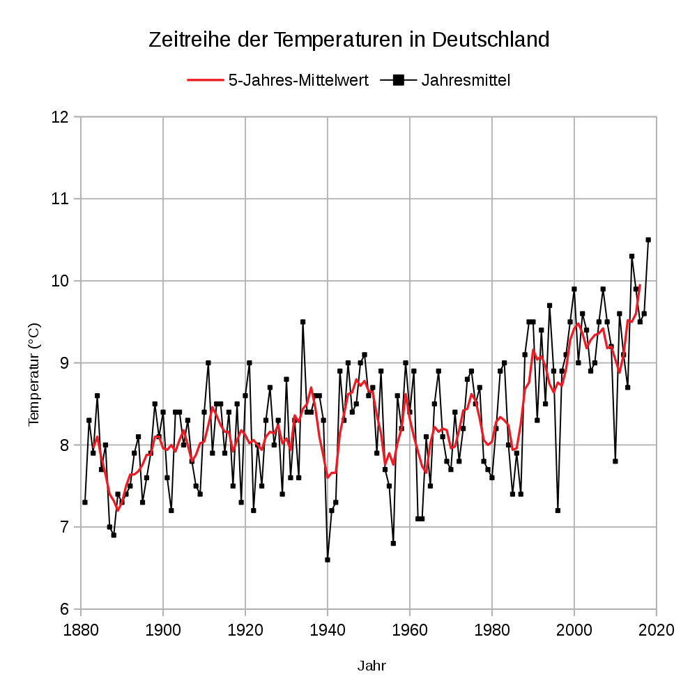

```{r setup, include=FALSE}
knitr::opts_chunk$set(echo = TRUE,message=FALSE,warning=FALSE)
#options(encoding="utf-8")
```

# 1. Abstract

The aim of this report is to investigate heating energy consumption in residential buildings in Germany over the time frame 2002-2018. The data on which this investigation is based come from the online portal of co2online.de, which has information on more than two million households in this time frame. (Trends in heating energy consumption).

Has political significance - Klimaschutz, CO2 footprint, etc.


# 2. Description of the data

The data gathered over the years was stored in different forms in different databases over the years. For the statistical analysis the data engineers had to extract the data from the database and was initially delivered in 10 different csv/excel files. Collecting these data into a single object, imposing consistency over the different files, and removing duplicates all formed part of the data cleaning process. This process was rather involved and is described in [this](https://github.com/bhaskar-kamble/co2online_stats) github repository. The final data are stored in Rdata objects `MFH20022018_v3.Rdata` and `SFH20022018_v3.Rdata`.

The various features involved (`energietraeger`, etc.). MFH is multifamily houses and 1-2FH is 1-2 family houses.

Do str(data) in the next section.

# 3. Getting and cleaning the data

```{r}
#path_to_file <- "D:/GITHUB_REPOS/visualization-project2-smurfs/"
path_to_file <- "./"
source(paste0(path_to_file , "getGermanyData.R"))
source(paste0(path_to_file , "cleanData.R"))
source(paste0(path_to_file , "getBundeslandfromCode.R"))
source(paste0(path_to_file , "getBundeslandfromLK.R"))
source(paste0(path_to_file , "getSpecificConsumptionByYear.R"))
source(paste0(path_to_file , "getConsumptionPerEnergieTraeger.R"))

#get data from the Rdata files, impose consistency in data types etc.
DL_MFH <- getGermanyData(gtype = "MFH")
DL_SFH <- getGermanyData(gtype = "SFH")

#remove outliers:
DL_MFH <- cleanData(DL_MFH , "MFH")
DL_SFH <- cleanData(DL_SFH , "SFH")

#find bundesland
DL_MFH <- getBundeslandfromCode(DL_MFH)
DL_SFH <- getBundeslandfromCode(DL_SFH)
DL_SFH <- DL_SFH[!is.na(DL_SFH$bundesland) , ]
DL_SFH <- getBundeslandfromLK(DL_SFH)
#unique(DL_MFH$bundesland)
#unique(DL_MFH$bundesland)

source(paste0(path_to_file, "getCentroidsFromShapeFile.R"))
source(paste0(path_to_file , "getCo2Emissions.R"))
```

# 4. Energy consumption trends across Germany

## 4a. Specific Energy Consumtion trends

```{r}
#library(mosaic)
#detach("package:mosaic", unload=TRUE)
MFH_spez_verbrauch <- getSpecificConsumptionByYear( DL_MFH , DL_SFH , gtype = "MFH")
SFH_spez_verbrauch <- getSpecificConsumptionByYear( DL_MFH , DL_SFH , gtype = "SFH")
ALL_spez_verbrauch <- getSpecificConsumptionByYear( DL_MFH , DL_SFH , gtype = "ALL")
```

```{r}
require(ggplot2)
ggplot() + geom_point(data=MFH_spez_verbrauch , aes(x=abrechnungsjahr,y=spz_verbrauch,color="MFH")
)+geom_point(data=SFH_spez_verbrauch , aes(x=abrechnungsjahr,y=spz_verbrauch,color="SFH")
)+geom_point(data=ALL_spez_verbrauch , aes(x=abrechnungsjahr,y=spz_verbrauch,color="ALL")
)+scale_color_discrete(name=" ",labels=c("ALL","MFH","SFH"))+scale_y_continuous(limits=c(0,150))+theme_bw()+scale_x_continuous(breaks=seq(2002,2018,2))+labs(x="Year",y=bquote("Specific Consumption" ~ (kWh/m^2)) )
```


```{r}
require(ggplot2)
gg_color_hue <- function(n) {
  hues = seq(15, 375, length = n + 1)
  hcl(h = hues, l = 65, c = 100)[1:n]
}
ggplot() + geom_point(data=MFH_spez_verbrauch , aes(x=abrechnungsjahr,y=spz_verbrauch,color="MFH")
)+geom_point(data=SFH_spez_verbrauch , aes(x=abrechnungsjahr,y=spz_verbrauch,color="SFH")
)+geom_point(data=ALL_spez_verbrauch , aes(x=abrechnungsjahr,y=spz_verbrauch,color="ALL")
)+geom_smooth(method="lm",data=MFH_spez_verbrauch,aes(x=abrechnungsjahr,y=spz_verbrauch),color=gg_color_hue(3)[2],se=FALSE
)+geom_smooth(method="lm",data=SFH_spez_verbrauch,aes(x=abrechnungsjahr,y=spz_verbrauch),color=gg_color_hue(3)[3],se=FALSE
)+geom_smooth(method="lm",data=ALL_spez_verbrauch,aes(x=abrechnungsjahr,y=spz_verbrauch),color=gg_color_hue(3)[1],se=FALSE
)+scale_color_discrete(name=" ",labels=c("ALL","MFH","SFH"))+scale_y_continuous(limits=c(0,150))+theme_bw()+scale_x_continuous(breaks=seq(2002,2018,2))+labs(x="Year",y=bquote("Specific Consumption" ~ (kWh/m^2)) )
```





```{r}
lm_mfh <- lm(spz_verbrauch ~ abrechnungsjahr , data = MFH_spez_verbrauch)
lm_sfh <- lm(spz_verbrauch ~ abrechnungsjahr , data = SFH_spez_verbrauch)
lm_all <- lm(spz_verbrauch ~ abrechnungsjahr , data = ALL_spez_verbrauch)
bmfh <- c(as.numeric(lm_mfh$coefficients[1]),as.numeric(lm_mfh$coefficients[2]))
bsfh <- c(as.numeric(lm_sfh$coefficients[1]),as.numeric(lm_sfh$coefficients[2]))
ball <- c(as.numeric(lm_all$coefficients[1]),as.numeric(lm_all$coefficients[2]))
slope_low  <- abs(c(confint(lm_mfh,"abrechnungsjahr",level=0.95)[2],confint(lm_sfh,"abrechnungsjahr",level=0.95)[2],confint(lm_all,"abrechnungsjahr",level=0.95)[2]))
slope_high  <- abs(c(confint(lm_mfh,"abrechnungsjahr",level=0.95)[1],confint(lm_sfh,"abrechnungsjahr",level=0.95)[1],confint(lm_all,"abrechnungsjahr",level=0.95)[1]))
slope_high <-
slopedata <- data.frame(gtype=c("MFH","SFH","Both"),slope=abs(c(bmfh[2],bsfh[2],ball[2])),slope_low=slope_low,slope_high=slope_high)
ggplot(data=slopedata,aes(x=gtype,y=slope))+geom_bar(stat="identity",width=0.5) + geom_errorbar(aes(ymin=slope_low,ymax=slope_high),width=0.2) + coord_flip() + labs(title="Rate of change of specific energy consumption in Germany (2002 - 2018)",x="Building type")+theme_bw()
```

## 4b. Proportion of fuel sources

```{r}
i <-  ggplot(data=relative_freq(DL_MFH), aes(x=abrechnungsjahr , y=value, fill=energietraeger)) +
  geom_bar(stat="identity") + scale_fill_brewer(palette="Dark2") + ggtitle('MFH - rel freq') +  theme_bw() +
  theme(plot.title = element_text(hjust = 0.5),legend.position=c(1.5,0.5),legend.direction="vertical")

require(grid)
require(gridExtra)

#grid.arrange(i,ncol=2)
i
```


```{r}
i <-  ggplot(data=relative_freq(DL_SFH), aes(x=abrechnungsjahr , y=value, fill=energietraeger)) +
  geom_bar(stat="identity")  + scale_fill_brewer(palette="Dark2") + ggtitle('SFH - relative freq') + 
  theme(plot.title = element_text(hjust = 0.5),legend.position=c(1.5,0.5),legend.direction="vertical") 

grid.arrange(i,ncol=2)
i
```

```{r}

i <- ggplot(data=relative_freq(rbind(DL_SFH, DL_MFH)), aes(x=abrechnungsjahr , y=value, fill=energietraeger)) +
  geom_bar(stat="identity")  + scale_fill_brewer(palette="Dark2") + ggtitle('MFH and SFH - relative freq') + 
  theme(plot.title = element_text(hjust = 0.5),legend.position=c(1.5,0.5),legend.direction="vertical") 

#grid.arrange(i,ncol=2)
#absolute_freq(rbind(DL_SFH, DL_MFH))
i
```


# 5. Energy consumption trends across the 16 Federal states

```{r}
#now subset bundesland and do the calculations for specific consumption
# (1) MFH case #calculate the specific consumption and the slope

states <- sort(unique(DL_MFH$bundesland))
bundlands_SV_mfh <- list()
bundlands_SV_sfh <- list()
bundlands_SV_all <- list()
for (s in states) {
  #For MFH:
  print(s)
  bund_data_mfh <- DL_MFH[DL_MFH$bundesland == s  ,  ]
  specific_con <- getSpecificConsumptionByYear(mfh=bund_data_mfh , sfh=NULL , gtype="MFH")
  #above is a dataframe with columns "abrechnungsjahr","Area","Consumption","spz_verbrauch"
  bundlands_SV_mfh[[s]] <- specific_con
  #For SFH:
  bund_data_sfh <- DL_SFH[DL_SFH$bundesland == s  ,  ]
  specific_con <- getSpecificConsumptionByYear(mfh=NULL , sfh=bund_data_sfh , gtype="SFH")
  bundlands_SV_sfh[[s]] <- specific_con
  #For both:
  specific_con <- getSpecificConsumptionByYear(mfh=bund_data_mfh , sfh=bund_data_sfh , gtype="ALL")
  bundlands_SV_all[[s]] <- specific_con
}

#collect into single data frame - these will be used for plotting in plotly
bundSV_mfh_df <- data.frame(abrechnungsjahr=2002:2018)
bundSV_sfh_df <- data.frame(abrechnungsjahr=2002:2018)
bundSV_all_df <- data.frame(abrechnungsjahr=2002:2018)
for (s in names(bundlands_SV_mfh)) {
  bundSV_mfh_df[[s]] <- bundlands_SV_mfh[[s]]$spz_verbrauch
  bundSV_sfh_df[[s]] <- bundlands_SV_sfh[[s]]$spz_verbrauch
  bundSV_all_df[[s]] <- bundlands_SV_all[[s]]$spz_verbrauch
}
```


## 5a. Specific Energy Consumption for MFH for the federal states

```{r}
get_VC <- function() {
  visibility_combinations <- list()
  i = 1
  for (state in states) {
    to = 16
    vis <- rep(F, to)
    vis[i] <- TRUE
    visibility_combinations[[i]] <- list(method = "restyle",
                                         args = list("visible", as.list(vis)),
                                         label = state)
    i = i + 1
  }
  return(visibility_combinations)
}
```


```{r}
library(plotly)
p <- plot_ly(bundSV_mfh_df , x = ~abrechnungsjahr) %>%
  add_markers(y = ~get(states[1]), name = " ",marker=list(color="black")) %>%
  add_markers(y = ~get(states[2]), name = " " , marker=list(color="black"), visible = F) %>%
  add_markers(y = ~get(states[3]), name = " " , marker=list(color="black"), visible = F) %>%
  add_markers(y = ~get(states[4]), name = " " , marker=list(color="black"), visible = F) %>%
  add_markers(y = ~get(states[5]), name = " " , marker=list(color="black"), visible = F) %>%
  add_markers(y = ~get(states[6]), name = " " , marker=list(color="black"), visible = F) %>%
  add_markers(y = ~get(states[7]), name = " " , marker=list(color="black"), visible = F) %>%
  add_markers(y = ~get(states[8]), name = " " , marker=list(color="black"), visible = F) %>%
  add_markers(y = ~get(states[9]), name = " " , marker=list(color="black"), visible = F) %>%
  add_markers(y = ~get(states[10]), name = " " , marker=list(color="black"), visible = F) %>%
  add_markers(y = ~get(states[11]), name = " " , marker=list(color="black"), visible = F) %>%
  add_markers(y = ~get(states[12]), name = " " , marker=list(color="black"), visible = F) %>%
  add_markers(y = ~get(states[13]), name = " " , marker=list(color="black"), visible = F) %>%
  add_markers(y = ~get(states[14]), name = " " , marker=list(color="black"), visible = F) %>%
  add_markers(y = ~get(states[15]), name = " " , marker=list(color="black"), visible = F) %>%
  add_markers(y = ~get(states[16]), name = " " , marker=list(color="black"), visible = F)

#p <- plot_ly(bundSV_mfh_df , x = ~abrechnungsjahr) %>% add_markers(y = ~get(states[1]), name = " ",marker=list(color="black"))
#for (i in 2:16) {
#  p <- p %>% add_markers(y = ~get(states[i]), name = " " , marker=list(color="black"), visible = F)
#}

p <- p %>% layout(showlegend=FALSE,
  title = "Multifamily Houses",
  xaxis = list(title = "Year",tickvals=list(2002,2004,2006,2008,2010,2012,2014,2016,2018)),
  yaxis = list(title = "kWh/m2",range=c(0,150),tickvals=list(0,20,40,60,80,100,120,140)),
  updatemenus = list(
    list(
      buttons = get_VC()
    )
  )
)

p
```


```{r}
abrechnungsjahr = 2002:2018
lm1 <- lm(as.matrix(bundSV_mfh_df[states[1]]) ~ abrechnungsjahr)
lm2 <- lm(as.matrix(bundSV_mfh_df[states[2]]) ~ abrechnungsjahr)
lm3 <- lm(as.matrix(bundSV_mfh_df[states[3]]) ~ abrechnungsjahr)
lm4 <- lm(as.matrix(bundSV_mfh_df[states[4]]) ~ abrechnungsjahr)
lm5 <- lm(as.matrix(bundSV_mfh_df[states[5]]) ~ abrechnungsjahr)
lm6 <- lm(as.matrix(bundSV_mfh_df[states[6]]) ~ abrechnungsjahr)
lm7 <- lm(as.matrix(bundSV_mfh_df[states[7]]) ~ abrechnungsjahr)
lm8 <- lm(as.matrix(bundSV_mfh_df[states[8]]) ~ abrechnungsjahr)
lm9 <- lm(as.matrix(bundSV_mfh_df[states[9]]) ~ abrechnungsjahr)
lm10 <- lm(as.matrix(bundSV_mfh_df[states[10]]) ~ abrechnungsjahr)
lm11 <- lm(as.matrix(bundSV_mfh_df[states[11]]) ~ abrechnungsjahr)
lm12 <- lm(as.matrix(bundSV_mfh_df[states[12]]) ~ abrechnungsjahr)
lm13 <- lm(as.matrix(bundSV_mfh_df[states[13]]) ~ abrechnungsjahr)
lm14 <- lm(as.matrix(bundSV_mfh_df[states[14]]) ~ abrechnungsjahr)
lm15 <- lm(as.matrix(bundSV_mfh_df[states[15]]) ~ abrechnungsjahr)
lm16 <- lm(as.matrix(bundSV_mfh_df[states[16]]) ~ abrechnungsjahr)
slope <- c(abs(summary(lm1)$coefficient[2]), abs(summary(lm2)$coefficient[2]), abs(summary(lm3)$coefficient[2]),abs(summary(lm4)$coefficient[2]), abs(summary(lm5)$coefficient[2]), abs(summary(lm6)$coefficient[2]),
abs(summary(lm7)$coefficient[2]), abs(summary(lm8)$coefficient[2]), abs(summary(lm9)$coefficient[2]), abs(summary(lm10)$coefficient[2]), abs(summary(lm11)$coefficient[2]), abs(summary(lm12)$coefficient[2]), abs(summary(lm13)$coefficient[2]), abs(summary(lm14)$coefficient[2]), abs(summary(lm15)$coefficient[2]), abs(summary(lm16)$coefficient[2]))
#slope <- sort(slope)
#states <- sort(unique(DL_MFH$bundesland))
mydata <-data.frame(slope, states)
mydata$states <- factor(mydata$states,levels=mydata$states[order(mydata$slope)])
p <-ggplot(mydata, aes(states, slope)) + geom_bar(stat = "identity")+ coord_flip()
p +labs(title="MFH",x="",y=bquote("kWh/(Year"~ m^2 ~ ")"))
```

```{r}
slopes_data <- data.frame(bundesland=states)
slope_values_mfh <- NULL
slope_values_sfh <- NULL
slope_values_all <- NULL
for (s in states) {
  lm_sv_bund_mfh <- lm(spz_verbrauch ~ abrechnungsjahr , data = bundlands_SV_mfh[[s]])
  lm_sv_bund_sfh <- lm(spz_verbrauch ~ abrechnungsjahr , data = bundlands_SV_sfh[[s]])
  lm_sv_bund_all <- lm(spz_verbrauch ~ abrechnungsjahr , data = bundlands_SV_all[[s]])
  
  slope_values_mfh <- c(slope_values_mfh , lm_sv_bund_mfh$coefficients[2])
  slope_values_sfh <- c(slope_values_sfh , lm_sv_bund_sfh$coefficients[2])
  slope_values_all <- c(slope_values_all , lm_sv_bund_all$coefficients[2])
}
slopes_data$MFH <- slope_values_mfh 
slopes_data$SFH <- slope_values_sfh
slopes_data$ALL <- slope_values_all

library(sf)
library(dplyr)
library(ggplot2)
DL_map <- st_read("shapefiles/gadm36_DEU_shp/gadm36_DEU_1.shp",stringsAsFactors = FALSE,quiet = TRUE)
#DL_map <- st_read("~/Desktop/visualization-project2-smurfs/shapefiles/gadm36_DEU_shp/gadm36_DEU_1.shp",
#                 stringsAsFactors = FALSE)
```

```{r}
library(tmap)
library(tmaptools)
DL_map$MFH <- slopes_data$MFH
tmap_mode("view")
tm_shape(DL_map) + tm_polygons("MFH",
                               id="NAME_1",
                               popup.vars=c("MFH"),
                               style="cont",
                               midpoint=NA,
                               palette="seq"
                               #legend.reverse=TRUE - Gives WRONG info!
)+tm_layout(aes.palette=list(seq="-RdYlGn"))
```


## 5b. Specific Energy Consumption for 1-2 Family Houses for the federal states

```{r}
p <- plot_ly(bundSV_sfh_df , x = ~abrechnungsjahr) %>%
  add_markers(y = ~get(states[1]), name = " ",marker=list(color="black")) %>%
  add_markers(y = ~get(states[2]), name = " " , marker=list(color="black"), visible = F) %>%
  add_markers(y = ~get(states[3]), name = " " , marker=list(color="black"), visible = F) %>%
  add_markers(y = ~get(states[4]), name = " " , marker=list(color="black"), visible = F) %>%
  add_markers(y = ~get(states[5]), name = " " , marker=list(color="black"), visible = F) %>%
  add_markers(y = ~get(states[6]), name = " " , marker=list(color="black"), visible = F) %>%
  add_markers(y = ~get(states[7]), name = " " , marker=list(color="black"), visible = F) %>%
  add_markers(y = ~get(states[8]), name = " " , marker=list(color="black"), visible = F) %>%
  add_markers(y = ~get(states[9]), name = " " , marker=list(color="black"), visible = F) %>%
  add_markers(y = ~get(states[10]), name = " " , marker=list(color="black"), visible = F) %>%
  add_markers(y = ~get(states[11]), name = " " , marker=list(color="black"), visible = F) %>%
  add_markers(y = ~get(states[12]), name = " " , marker=list(color="black"), visible = F) %>%
  add_markers(y = ~get(states[13]), name = " " , marker=list(color="black"), visible = F) %>%
  add_markers(y = ~get(states[14]), name = " " , marker=list(color="black"), visible = F) %>%
  add_markers(y = ~get(states[15]), name = " " , marker=list(color="black"), visible = F) %>%
  add_markers(y = ~get(states[16]), name = " " , marker=list(color="black"), visible = F)

p <- p %>% layout(showlegend=FALSE,
  title = "1-2 Family Houses",
  xaxis = list(title = "Year",tickvals=list(2002,2004,2006,2008,2010,2012,2014,2016,2018)),
  yaxis = list(title = "kWh/m2",range=c(0,180),tickvals=list(0,20,40,60,80,100,120,140,160,180)),
  updatemenus = list(
    list(
      buttons = get_VC()
    )
  )
)

p
```


```{r}
lm1 <- lm(as.matrix(bundSV_sfh_df[states[1]]) ~ abrechnungsjahr)
lm2 <- lm(as.matrix(bundSV_sfh_df[states[2]]) ~ abrechnungsjahr)
lm3 <- lm(as.matrix(bundSV_sfh_df[states[3]]) ~ abrechnungsjahr)
lm4 <- lm(as.matrix(bundSV_sfh_df[states[4]]) ~ abrechnungsjahr)
lm5 <- lm(as.matrix(bundSV_sfh_df[states[5]]) ~ abrechnungsjahr)
lm6 <- lm(as.matrix(bundSV_sfh_df[states[6]]) ~ abrechnungsjahr)
lm7 <- lm(as.matrix(bundSV_sfh_df[states[7]]) ~ abrechnungsjahr)
lm8 <- lm(as.matrix(bundSV_sfh_df[states[8]]) ~ abrechnungsjahr)
lm9 <- lm(as.matrix(bundSV_sfh_df[states[9]]) ~ abrechnungsjahr)
lm10 <- lm(as.matrix(bundSV_sfh_df[states[10]]) ~ abrechnungsjahr)
lm11 <- lm(as.matrix(bundSV_sfh_df[states[11]]) ~ abrechnungsjahr)
lm12 <- lm(as.matrix(bundSV_sfh_df[states[12]]) ~ abrechnungsjahr)
lm13 <- lm(as.matrix(bundSV_sfh_df[states[13]]) ~ abrechnungsjahr)
lm14 <- lm(as.matrix(bundSV_sfh_df[states[14]]) ~ abrechnungsjahr)
lm15 <- lm(as.matrix(bundSV_sfh_df[states[15]]) ~ abrechnungsjahr)
lm16 <- lm(as.matrix(bundSV_sfh_df[states[16]]) ~ abrechnungsjahr)
library(ggplot2)
slope <- c(abs(summary(lm1)$coefficient[2]), abs(summary(lm2)$coefficient[2]), abs(summary(lm3)$coefficient[2]),abs(summary(lm4)$coefficient[2]), abs(summary(lm5)$coefficient[2]), abs(summary(lm6)$coefficient[2]),
abs(summary(lm7)$coefficient[2]), abs(summary(lm8)$coefficient[2]), abs(summary(lm9)$coefficient[2]), abs(summary(lm10)$coefficient[2]), abs(summary(lm11)$coefficient[2]), abs(summary(lm12)$coefficient[2]), abs(summary(lm13)$coefficient[2]), abs(summary(lm14)$coefficient[2]), abs(summary(lm15)$coefficient[2]), abs(summary(lm16)$coefficient[2]))
#slope <- sort(slope)
#states <- sort(unique(DL_MFH$bundesland))
mydata <-data.frame(slope, states)
mydata$states <- factor(mydata$states,levels=mydata$states[order(mydata$slope)])
p <-ggplot(mydata, aes(states, slope)) + geom_bar(stat = "identity")+ coord_flip()
p +labs(title="SFH",x="",y=bquote("kWh/(Year"~ m^2 ~ ")"))
```


```{r}
DL_map$SFH <- slopes_data$SFH #merge or inner_join gives error
tmap_mode("view")
tm_shape(DL_map) + tm_polygons("SFH",
                               id="NAME_1",
                               popup.vars=c("SFH"),
                               style="cont",
                               midpoint=NA,
                               palette="seq"
                               #legend.reverse=TRUE - Gives WRONG info!
)+tm_layout(aes.palette=list(seq="-RdYlGn"))
```


## 5c. Specific Energy Consumption for Multi and 1-2 Family Houses combined for the federal states


```{r}
p <- plot_ly(bundSV_all_df , x = ~abrechnungsjahr) %>%
  add_markers(y = ~get(states[1]), name = " ",marker=list(color="black")) %>%
  add_markers(y = ~get(states[2]), name = " " , marker=list(color="black"), visible = F) %>%
  add_markers(y = ~get(states[3]), name = " " , marker=list(color="black"), visible = F) %>%
  add_markers(y = ~get(states[4]), name = " " , marker=list(color="black"), visible = F) %>%
  add_markers(y = ~get(states[5]), name = " " , marker=list(color="black"), visible = F) %>%
  add_markers(y = ~get(states[6]), name = " " , marker=list(color="black"), visible = F) %>%
  add_markers(y = ~get(states[7]), name = " " , marker=list(color="black"), visible = F) %>%
  add_markers(y = ~get(states[8]), name = " " , marker=list(color="black"), visible = F) %>%
  add_markers(y = ~get(states[9]), name = " " , marker=list(color="black"), visible = F) %>%
  add_markers(y = ~get(states[10]), name = " " , marker=list(color="black"), visible = F) %>%
  add_markers(y = ~get(states[11]), name = " " , marker=list(color="black"), visible = F) %>%
  add_markers(y = ~get(states[12]), name = " " , marker=list(color="black"), visible = F) %>%
  add_markers(y = ~get(states[13]), name = " " , marker=list(color="black"), visible = F) %>%
  add_markers(y = ~get(states[14]), name = " " , marker=list(color="black"), visible = F) %>%
  add_markers(y = ~get(states[15]), name = " " , marker=list(color="black"), visible = F) %>%
  add_markers(y = ~get(states[16]), name = " " , marker=list(color="black"), visible = F)
#https://stackoverflow.com/questions/34093169/horizontal-vertical-line-in-plotly
p <- p %>% layout(showlegend=FALSE,
  title = "Multi and 1-2 Family Houses",
  xaxis = list(title = "Year",tickvals=list(2002,2004,2006,2008,2010,2012,2014,2016,2018)),
  yaxis = list(title = "kWh/m2",range=c(0,160),tickvals=list(0,20,40,60,80,100,120,140,160)),
  shapes=list(type='line', x0= 2001, x1= 2001, y0=0, y1=160, line=list(width=1)),
  updatemenus = list(
    list(
      buttons = get_VC()
    )
  )
)

p
```

```{r}
lm1 <- lm(as.matrix(bundSV_all_df[states[1]]) ~ abrechnungsjahr)
lm2 <- lm(as.matrix(bundSV_all_df[states[2]]) ~ abrechnungsjahr)
lm3 <- lm(as.matrix(bundSV_all_df[states[3]]) ~ abrechnungsjahr)
lm4 <- lm(as.matrix(bundSV_all_df[states[4]]) ~ abrechnungsjahr)
lm5 <- lm(as.matrix(bundSV_all_df[states[5]]) ~ abrechnungsjahr)
lm6 <- lm(as.matrix(bundSV_all_df[states[6]]) ~ abrechnungsjahr)
lm7 <- lm(as.matrix(bundSV_all_df[states[7]]) ~ abrechnungsjahr)
lm8 <- lm(as.matrix(bundSV_all_df[states[8]]) ~ abrechnungsjahr)
lm9 <- lm(as.matrix(bundSV_all_df[states[9]]) ~ abrechnungsjahr)
lm10 <- lm(as.matrix(bundSV_all_df[states[10]]) ~ abrechnungsjahr)
lm11 <- lm(as.matrix(bundSV_all_df[states[11]]) ~ abrechnungsjahr)
lm12 <- lm(as.matrix(bundSV_all_df[states[12]]) ~ abrechnungsjahr)
lm13 <- lm(as.matrix(bundSV_all_df[states[13]]) ~ abrechnungsjahr)
lm14 <- lm(as.matrix(bundSV_all_df[states[14]]) ~ abrechnungsjahr)
lm15 <- lm(as.matrix(bundSV_all_df[states[15]]) ~ abrechnungsjahr)
lm16 <- lm(as.matrix(bundSV_all_df[states[16]]) ~ abrechnungsjahr)
slope <- c(abs(summary(lm1)$coefficient[2]), abs(summary(lm2)$coefficient[2]), abs(summary(lm3)$coefficient[2]),abs(summary(lm4)$coefficient[2]), abs(summary(lm5)$coefficient[2]), abs(summary(lm6)$coefficient[2]),
abs(summary(lm7)$coefficient[2]), abs(summary(lm8)$coefficient[2]), abs(summary(lm9)$coefficient[2]), abs(summary(lm10)$coefficient[2]), abs(summary(lm11)$coefficient[2]), abs(summary(lm12)$coefficient[2]), abs(summary(lm13)$coefficient[2]), abs(summary(lm14)$coefficient[2]), abs(summary(lm15)$coefficient[2]), abs(summary(lm16)$coefficient[2]))
#slope <- sort(slope)
#states <- sort(unique(DL_MFH$bundesland))
mydata <-data.frame(slope, states)
mydata$states <- factor(mydata$states,levels=mydata$states[order(mydata$slope)])
p <-ggplot(mydata, aes(states, slope)) + geom_bar(stat = "identity")+ coord_flip()
p +labs(title="ALL",x="",y=bquote("kWh/(Year"~ m^2 ~ ")"))
```


```{r}
DL_map$ALL <- slopes_data$ALL #merge or inner_join gives error
tmap_mode("view")
tm_shape(DL_map) + tm_polygons("ALL",
                               id="NAME_1",
                               popup.vars=c("ALL"),
                               style="cont",
                               midpoint=NA,
                               palette="seq"
                               #legend.reverse=TRUE - Gives WRONG info!
)+tm_layout(aes.palette=list(seq="-RdYlGn"))
```


```{r}
library(plotly)

tmp <- aggregate(DL_MFH[,c('bundesland','abrechnungsjahr','verbrauch_gesamt_kwh_spez')][c(-1, -2)], by=list(DL_MFH$bundesland, DL_MFH$abrechnungsjahr), FUN = mean)
p <- plot_ly(
    x = tmp$Group.2, y = tmp$Group.1,
    z = tmp$verbrauch_gesamt_kwh_spez, type = "heatmap") %>% layout(
    title = 'Consumption per Bundesland and year for MFH',
    xaxis = list(range = 2012:2018))


p
```

```{r}
library(plotly)

tmp <- aggregate(DL_MFH[,c('bundesland','abrechnungsjahr','verbrauch_gesamt_kwh_spez')][c(-1, -2)], by=list(DL_MFH$bundesland, DL_MFH$abrechnungsjahr), FUN = mean)
p <- plot_ly(
    x = tmp$Group.2, y = tmp$Group.1,
    z = tmp$verbrauch_gesamt_kwh_spez, type = "heatmap") %>% layout(
    title = 'Consumption per Bundesland and year for SFH',
    xaxis = list(range = 2012:2018))


p
```

```{r}
library(plotly)

bind <- rbind(DL_MFH,DL_SFH)[,c('bundesland','abrechnungsjahr','verbrauch_gesamt_kwh_spez')]
tmp <- aggregate(bind[c(-1, -2)], 
                 by=list(bind$bundesland, bind$abrechnungsjahr), FUN =mean)
p <- plot_ly(
    x = tmp$Group.2, y = tmp$Group.1,
    z = tmp$verbrauch_gesamt_kwh_spez, type = "heatmap") %>% layout(
    title = 'Consumption per Bundesland and year for MFH & SFH',
    xaxis = list(range = 2012:2018))


p
```


## 5d. Interactive Maps (show also confidence intervals), like in `02_Bundesland.Rmd` for federal states for Multifamily houses


## 5e. Interactive maps for federal states for 1-2 family houses


## 5f. Interactive maps for federal states for Multi and 1-2 family houses combined
```{r}
library(plotly)
library(tidyr)
get_relative_frequencies_interactive <- function(data, title) {
  bundlands_energietraeger <- average_by_year_bundesland_energietrager(data)
  
  p <- plot_ly(type = 'bar', colors = "Blues") 
  
  p <- plot_ly(type = 'bar')
  v = TRUE
  for (i in 1:length(states)) {
    p <- p %>% add_trace(y = bundlands_energietraeger[bundlands_energietraeger$bundesland == states[[i]],]$erdgas, name = 'Erdgas',  
                         x = 2002:2018, visible = v)
    p <- p %>% add_trace(y = bundlands_energietraeger[bundlands_energietraeger$bundesland == states[[i]],]$fluessiggas, name = 'Fluessiggas',  
                         x = 2002:2018, visible = v)
    p <- p %>% add_trace(y = bundlands_energietraeger[bundlands_energietraeger$bundesland == states[[i]],]$heizoel, name = 'Heizoel',  
                         x = 2002:2018, visible = v)
    p <- p %>% add_trace(y = bundlands_energietraeger[bundlands_energietraeger$bundesland == states[[i]],]$holzpellets, name = 'Holzpellets',  
                         x = 2002:2018, visible = v)
    p <- p %>% add_trace(y = bundlands_energietraeger[bundlands_energietraeger$bundesland == states[[i]],]$strom, name = 'Strom',  
                         x = 2002:2018, visible = v)
    p <- p %>% add_trace(y = bundlands_energietraeger[bundlands_energietraeger$bundesland == states[[i]],]$waerme, name = 'Waerme',  
                         x = 2002:2018, visible = v)
  
    v = FALSE
  }
  
  
  p <- p %>% layout(
      xaxis = list(range = c(2001, 2019)),
      barmode='stack',
      colorway = c('#e8288a','#1f9d75', '#e2ab07', '#756eb2', '#d95e00', '#68a61e'))
  
  p <- p %>% layout(
    title = title,
    xaxis = list(title = "Year", range = c(2001, 2019)),
    yaxis = list(title = "Value"),
    barmode ='stack',
    updatemenus = list(
      list(
        buttons = get_visibility_combinations()
      )
    )
  )
  return(p)
}
```

```{r}
library(plotly)
library(tidyr)
get_relative_frequencies_interactive_all <- function() {
  bundlands_energietraeger_all <- average_by_year_energietrager(rbind(DL_MFH, DL_SFH))
  bundlands_energietraeger_mfh <- average_by_year_energietrager(DL_MFH)
  bundlands_energietraeger_sfh <- average_by_year_energietrager(DL_SFH)

p <- plot_ly(type = 'bar', colors = "Blues") 
  
  p <- plot_ly(type = 'bar')
  v = TRUE
  for (i in 1:3) {
    if (i == 3)
      data <-  bundlands_energietraeger_sfh
    else if (i == 2)
      data <-  bundlands_energietraeger_mfh
    else
      data <- bundlands_energietraeger_all
    p <- p %>% add_trace(y = data$erdgas, name = 'Erdgas',  
                         x = 2002:2018, visible = v)
    p <- p %>% add_trace(y = data$fluessiggas, name = 'Fluessiggas',  
                         x = 2002:2018, visible = v)
    p <- p %>% add_trace(y = data$heizoel, name = 'Heizoel',  
                         x = 2002:2018, visible = v)
    p <- p %>% add_trace(y = data$holzpellets, name = 'Holzpellets',  
                         x = 2002:2018, visible = v)
    p <- p %>% add_trace(y = data$strom, name = 'Strom',  
                         x = 2002:2018, visible = v)
    p <- p %>% add_trace(y = data$waerme, name = 'Waerme',  
                         x = 2002:2018, visible = v)
  
    v = FALSE
  }
  
  p <- p %>% layout(
      xaxis = list(range = c(2001, 2019)),
      barmode='stack',
      colorway = c('#e8288a','#1f9d75', '#e2ab07', '#756eb2', '#d95e00', '#68a61e'))
  
  p <- p %>% layout(
    title = 'Procentual consumption per fuel',
    xaxis = list(title = "Year", range = c(2001, 2019)),
    yaxis = list(title = "Value"),
    barmode ='stack',
    updatemenus = list(
      list(
        buttons = get_visibility_combinations_co2()
      )
    )
  )
  return(p)
}
```


```{r}
get_co2_emissions_interactive_all <- function() {
  bundlands_energietraeger_all <- convert_area_to_co2_emissions_all(all_area, rbind(DL_MFH, DL_SFH), co2_coef)
  bundlands_energietraeger_mfh <- convert_area_to_co2_emissions_all(all_area, DL_MFH, co2_coef)
  bundlands_energietraeger_sfh <- convert_area_to_co2_emissions_all(all_area , DL_SFH, co2_coef)
  
  x_axis <- 2002:2017
  p <- plot_ly(x = ~x_axis, type="scatter", mode="markers+lines")
  v = TRUE
  for (i in 1:3) {
    if (i == 3)
      data <-  bundlands_energietraeger_sfh
    else if (i == 2)
      data <-  bundlands_energietraeger_mfh
    else
      data <- bundlands_energietraeger_all
    p <- add_trace(p,y = data$erdgas, name = 'Erdgas',  x =  ~x_axis, visible = v, type = 'scatter',
             mode = 'lines+markers') 
    p <- add_trace(p,y = data$fluessiggas, name = 'Fluessiggas', x = ~x_axis, visible = v, type = 'scatter',
             mode = 'lines+markers') 
    p <- add_trace(p,y = data$heizoel, name = 'Heizoel', x = ~x_axis, visible = v, type = 'scatter',
             mode = 'lines+markers') 
    p <- add_trace(p,y =data$holzpellets, name = 'Holzpellets', x = ~x_axis, visible = v, type = 'scatter',
             mode = 'lines+markers') 
    p <- add_trace(p,y = data$strom, name = 'Strom', x = ~x_axis, visible = v, type = 'scatter',
             mode = 'lines+markers') 
    p <- add_trace(p, y = data$waerme, name = 'Waerme', x = ~x_axis, visible = v, type = 'scatter',
             mode = 'lines+markers') 
    v = FALSE
  }
  
  
  p <- p %>% layout(
      xaxis = list(range = c(2001, 2018)),
      colorway = c('#e8288a','#1f9d75', '#e2ab07', '#756eb2', '#d95e00', '#68a61e'))
  
  p <- p %>% layout(
    title = 'CO2 Emissions in all Germany',
    xaxis = list(title = "Year", range = c(2001, 2018)),
    yaxis = list(title = "Value"),
    barmode ='stack',
    updatemenus = list(
      list(
        buttons = get_visibility_combinations_co2()
      )
    )
  )
  return(p)
}

```


```{r}
get_co2_emissions_interactive <- function(data, energy_consumption_data, co2_coef, title) {
  bundlands_energietraeger <- convert_area_to_co2_emissions(data, energy_consumption_data, co2_coef)
  
  x_axis <- 2002:2018
  p <- plot_ly(x = ~x_axis, type="scatter", mode="markers+lines")
  v = TRUE
  for (i in 1:length(states)) {
    p <- add_trace(p,y = bundlands_energietraeger[bundlands_energietraeger$bundesland == states[[i]],]$erdgas, name = 'Erdgas',  
                         x =  ~x_axis, visible = v,
             type = 'scatter',
             mode = 'lines+markers') 
    p <- add_trace(p,y = bundlands_energietraeger[bundlands_energietraeger$bundesland == states[[i]],]$fluessiggas, name = 'Fluessiggas',  
                         x = ~x_axis, visible = v,
                         
             type = 'scatter',
             mode = 'lines+markers') 
    p <- add_trace(p,y = bundlands_energietraeger[bundlands_energietraeger$bundesland == states[[i]],]$heizoel, name = 'Heizoel',  
                         x = ~x_axis, visible = v,
                         
             type = 'scatter',
             mode = 'lines+markers') 
    p <- add_trace(p,y = bundlands_energietraeger[bundlands_energietraeger$bundesland == states[[i]],]$holzpellets, name = 'Holzpellets',  
                         x = ~x_axis, visible = v,
                         
             type = 'scatter',
             mode = 'lines+markers') 
    p <- add_trace(p,y = bundlands_energietraeger[bundlands_energietraeger$bundesland == states[[i]],]$strom, name = 'Strom',  
                         x = ~x_axis, visible = v,
                         
             type = 'scatter',
             mode = 'lines+markers') 
    p <- add_trace(p, y = bundlands_energietraeger[bundlands_energietraeger$bundesland == states[[i]],]$waerme, name = 'Waerme',  
                         x = ~x_axis, visible = v,
                         
             type = 'scatter',
             mode = 'lines+markers') 
  
    v = FALSE
  }
  
  
  p <- p %>% layout(
      xaxis = list(range = c(2001, 2019)),
      colorway = c('#e8288a','#1f9d75', '#e2ab07', '#756eb2', '#d95e00', '#68a61e'))
  
  p <- p %>% layout(
    title = title,
    xaxis = list(title = "Year", range = c(2001, 2019)),
    yaxis = list(title = "Value"),
    barmode ='stack',
    updatemenus = list(
      list(
        buttons = get_visibility_combinations()
      )
    )
  )
  return(p)
}

```


```{r}
get_relative_frequencies_interactive_all()
```

```{r}
get_co2_emissions_interactive_all()
```

```{r}
get_relative_frequencies_interactive(rbind(DL_SFH, DL_MFH), 'SFH & MFH - Procentual consumption per fuel by bundesland')
```

```{r}
library(plotly)
library(tidyr)

get_co2_emissions_interactive(mfh_area, rbind(DL_SFH, DL_MFH), co2_coef, 'SFH & MFH - Co2 Emissions by Bundesland')
```

```{r}
get_relative_frequencies_interactive(DL_MFH, 'MFH - Procentual consumption per fuel by bundesland')
```

```{r}
library(plotly)
library(tidyr)

get_co2_emissions_interactive(mfh_area, DL_MFH, co2_coef, 'MFH - Co2 Emissions by Bundesland')
```

```{r}
get_relative_frequencies_interactive(DL_SFH, 'SFH - Procentual consumption per fuel by bundesland')
```

```{r}
library(plotly)
library(tidyr)

get_co2_emissions_interactive(mfh_area, DL_SFH, co2_coef, 'SFH - Co2 Emissions by Bundesland')
```


```{r}
library(plotly)
library(tidyr)
plot_som(DL_MFH)
```

```{r}
library(plotly)
library(tidyr)
plot_som(DL_SFH)
```


* Breakdown of energy consumption by energietraeger (making a cumulative graph by energietrager) for Germany.
* Breakdown of energy consumption by energietraeger (making a cumulative graph by energietrager) for Bundesland - check if plotly for ggplot is possible.
* Breakdown of relative energy consumption by energietraeger (making a cumulative graph by energietrager) for Germany.
* Breakdown of relative energy consumption by energietraeger (making a cumulative graph by energietrager) for Bundesland - check if plotly for ggplot is possible.
* Bezirk analysis of Berlin - percentage of Fernw?rme in each Bezirk (for example).
